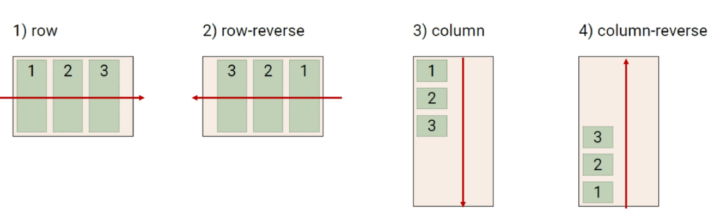
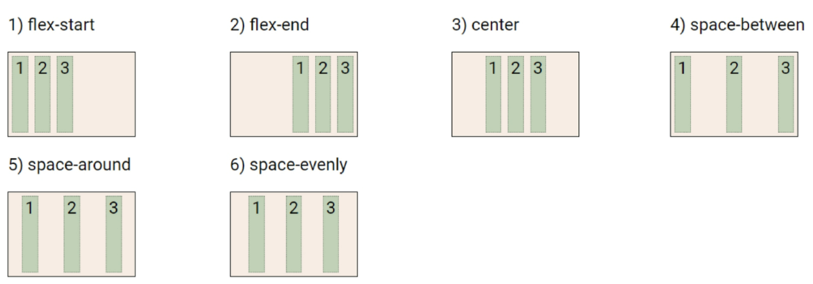
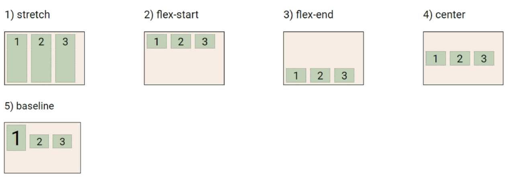
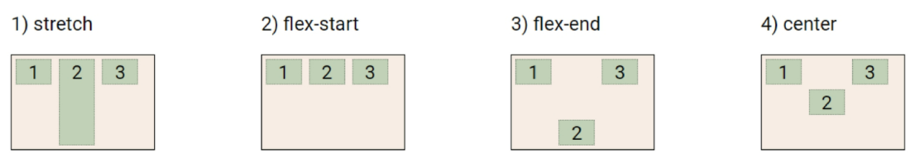
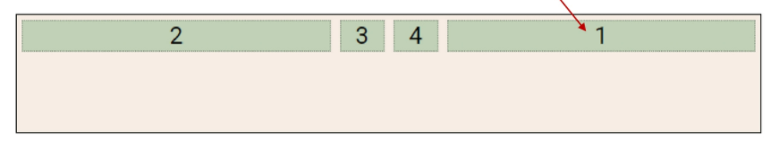
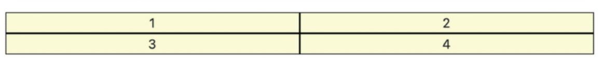
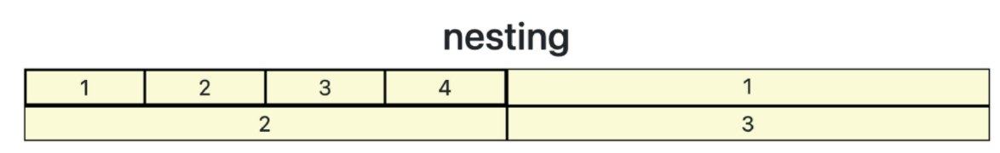
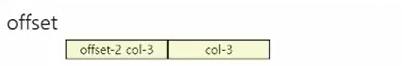

# 2022-02-07

# 1. Flexbox

## 1. CSS Flexible Box Layout

- 행과 열 형태로 아이템들을 배치하는 1차원 레이아웃 모델
  - 내부 영역 안에서의 배치
- **축**
  - main axis (메인 축) 
    - `flex-direction : row` => 메인 축이 가로, 교차 축이 세로
    - `flex-direction : column` => 메인 축이 세로, 교차 축이 가로
  - cross axis (교차 축)
- **구성 요소**
  - **Flex Container (부모 요소)**
    - flexbox 레이아웃을 형성하는 가장 기본적인 모델
    - flex item들이 놓여있는 영역
    - display 속성을 flex 혹은 inline-flex로 지정
      - `display: flex;`
  - **Flex Item (자식 요소)**
    - 컨테이너에 속해 있는 컨텐츠 (박스)
- **수직 정렬**
- **아이템의 너비와 높이 혹은 간격을 동일하게 배치**


## 2. Flex 속성

1. **배치 설정**

   - **`flex-direction`** 

     - main axis 기준 방향 설정

     - 역방향의 경우 HTML 태그 선언 순서와 시각적으로 다르니 유의 (웹 접근성에 영향)

     - ```css
       row
       row-reverse /*마크업 자체는 1-2-3 순서*/
       column
       coulmn-reverse
       ```

     - 

     - **`flex-wrap`**

       - 요소들이 강제로 한 줄에 배치되게 할 것인지 여부 설정

       - 아이템이 컨테이너를 벗어나는 경우 해당 영역 내에 배치되도록 설정

       - 즉, 기본적으로 컨테이너 영역을 벗어나지 않도록 함

       - ```css
         wrap /*넘치면 그 다음 줄로 배치*/
         nowrap /*(기본값) 한 줄에 배치*/
         ```

       - 

   - **`flex-flow`**
     - `flex-direction`과 `flex-wrap`의 shorthand
     - `flex-direction`과 `flex-wrap`에 대한 설정 값을 차례로 작성
       - `flex-flow: row nowrap;`

2. **공간 나누기**

   - **`justify-content`** (main axis)

     - main axis를 기준으로 공간 배분

     - ```css
       flex-start /*기본값, 아이템들을 axis 시작점으로*/
       flex-end /*아이템들을 axis 끝 쪽으로*/
       center /*아이템들을 axis 중앙으로*/
       space-between /*아이템 사이의 간격을 균일하게 분배*/
       space-around /*아이템을 둘러싼 영역을 균일하게 분배 (가질 수 있는 영역을 반으로 나눠서 양쪽에)*/
       space-evenly /*전체 영역에서 아이템 간 간격을 균일하게 분배*/
       ```

     - 

   - **`align-content`** (cross axis) 

     - cross axis를 기준으로 공간 배분

       - 아이템이 한 줄로 배치되는 경우 확인할 수 없음 (여러 줄!)

     - ```css
       flex-start
       flex-end
       center
       space-between
       space-around
       space-evenly
       ```

     - 

3. **정렬**

   - **`align-items`** 

     - **모든 아이템**을 cross axis 기준으로 정렬

       - 아이템이 한 줄로 배치되는 경우

     - ```css
       stretch /*기본값, 컨테이너를 가득 채움*/
       flex-start
       flex-end
       center
       baseline /*텍스트 baseline에 기준선을 맞춤*/
       ```

     - 

   - **`align-self`**

     - **개별 아이템**을 cross axis 기준으로 정렬

     - ```css
       stretch
       flex-start
       flex-end
       center
       ```

     - 

 4. 기타

    - `flex-grow` : 남은 영역을 아이템에 분배

    - `order` : 배치 순서

    - ```html
      <div class="flex_item grow-1 order-3">1</div>
      <div class="flex_item grow-1">2</div>
      <div class="flex_item order-1">3</div>
      <div class="flex_item order-2">4</div>
      ```

    - 
    
    - 블럭요소에서 `margin: auto;` 하면 좌우 margin 중앙 정렬
    
      - 블럭은 원래 상하에 margin 없었음
    
    - flexbox에서 `margin: auto;` 하면 상하좌우 margin 중앙 정렬

-----

# 2. Bootstrap

## 1. CDN (Content Delivery/Distribution Network)

- 컨텐츠 (CSS, JS, Image, Text 등)을 효율적으로 전달하기 위해 여러 노드에 가진 네트워크에 데이터를 제공하는 시스템


## 2. Spacing

- 브라우저 html의 root 글꼴 크기는 16px

- | class name | rem  | px   |
  | ---------- | ---- | ---- |
  | m-1        | 0.25 | 4    |
  | m-2        | 0.5  | 8    |
  | m-3        | 1    | 16   |
  | m-4        | 1.5  | 24   |
  | m-5        | 3    | 48   |

- `.mx-0` : 좌우 margin 0

- `.mx-auto` : 수평 중앙 정렬

- `.ms-auto` : 오른쪽 정렬

- `.py-0` : 패딩 위 아래 똑같이 주기

- |       |             | t     | top             | 0    | 0 rem        | 0px      |
  | ----- | ----------- | ----- | --------------- | ---- | ------------ | -------- |
  |       |             | **b** | **bottom**      | 1    | **0.25 rem** | **4px**  |
  | **m** | **margin**  | **s** | **left**        | 2    | **0.5 rem**  | **8px**  |
  | **p** | **padding** | **e** | **right**       | 3    | **1 rem**    | **16px** |
  |       |             | **x** | **left, right** | 4    | **1.5 rem**  | **24px** |
  |       |             | **y** | **top, bottom** | 5    | **3 rem**    | **48px** |


## 3. Color

- 배경 색 / 글씨 색

  ```html
  <div class="bg-primary">이건 파랑 배경</div>
  <p class="text-success">이건 초록색 글씨</p>
  ```


## 4. Text

```html
<h2>Text</h2>
<p class="text-start">텍스트 왼쪽 정렬</p>
<p class="text-center">텍스트 중앙 정렬</p>
<p class="text-end">텍스트 오른쪽 정렬</p>

<a href="#" class="text-decoration-none">a 태그하면 밑줄 생기는데 그 밑줄 없애줌</a>

<p class="fw-bold">굵은 글씨</p>
<p class="fw-normal">일반 글씨</p>
<p class="fw-light">얇은 글씨</p>
<p class="fst-italic">이태릭 글씨</p>
```


## 5. Display

```html
<h2>Display</h2>
<div class="d-inline p-2 bg-primary text-white">인라인요소,패딩:0.5rem,배경색:primary,텍스트:흰색</div>
<div class="d-block p-2 bg-dark text-white">블럭요소,패딩:0.5rem,배경색:dark,텍스트:흰색</div>
<div class="box bg-warning d-sm-none d-md-block">박스, 배경색:warning, sm일때:안보임, md일때:박스로 보임</div>

<div class="box fixed-top">위에 박스 고정</div>
<div class="box fixed-bottom">아래에 박스 고정</div>

<div class="d-flex justify-content-start">flexbox 주축 기준 start부터 정렬</div>
<div class="d-flex align-items-start">flexbox 교차축 기준 start부터 정렬</div>
<div class="d-flex">
	<div class="align-self-start">flexbox 내 특정아이템을 교차축 기준 start부터 정렬</div>
</div>
```

---

# 3. Responsive Web

- 같은 컨텐츠를 보는 각기 다른 디바이스
- 웹 디자인에 대한 접근 방식, 반응형 레이아웃 작성에 도움이 되는 사례들의 모음 등을 기술하는데 사용

---

# 4. Bootstrap Grid System

## 1. Grid System

- 요소들의 디자인과 배치에 도움을 줌
- 기본 요소
  - Column : 실제 컨텐츠를 포함하는 부분
  - Gutter : 칼럼과 칼럼 사이의 공간 (간격)
  - Container : Column들을 담고 있는 공간


## 2. Bootstrap grid system

- flexbox로 제작됨

- `box-sizing : border-box`로 설정되어있음

- script 태그는 일반적으로 body 닫는 태그 위에 써줌

- container, rows, column으로 컨텐츠를 배치하고 정렬

- **12개의 column** (약수가 많아서)

- **6개의 grid breakpoints**

- ```html
  <div class="container">
      <div class="row">
          <div class="col"></div>
          <div class="col"></div>
          <div class="col"></div>
      </div>
  </div>
  ```

- |                  | xs                               | sm                               | md                               | lg                               | xl                               | xxl                              |
  | ---------------- | -------------------------------- | -------------------------------- | -------------------------------- | -------------------------------- | -------------------------------- | -------------------------------- |
  |                  | **<576px**                       | **>=576px**                      | **>=768px**                      | **>=992px**                      | **>=1200px**                     | **>=1400px**                     |
  | **class**        | `.col-`                          | `.col-sm-`                       | `.col-md-`                       | `.col-lg-`                       | `.col-xl-`                       | `.col-xxl-`                      |
  | **gutter width** | 1.5rem (좌우로 0.75rem씩 들어감) | 1.5rem (좌우로 0.75rem씩 들어감) | 1.5rem (좌우로 0.75rem씩 들어감) | 1.5rem (좌우로 0.75rem씩 들어감) | 1.5rem (좌우로 0.75rem씩 들어감) | 1.5rem (좌우로 0.75rem씩 들어감) |

- ```html
  <div class="container">
  	<div class="row">
      	<div class="box col">1</div>
      	<div class="box col">2</div>
      	<div class="w-100"></div>
      	<div class="box col">3</div>
      	<div class="box col">4</div>
  	</div>
  ------------------------------------------
  	<div class="row">
     		<div class="box col">1</div>
      	<div class="box col">2</div>
  	</div>
  	<div class="row">
      	<div class="box col">3</div>
      	<div class="box col">4</div>
  	</div>
  </div>	
  
  둘이 같은 결과
  ```

  - 

- nesting

  - ```html
    <div class="container">
        <div class="row">
            <div class="box col-6">
                <!--안에 영역에서도 새로 12칸이라고 생각-->
                <div class="box col-3">1</div>
                <div class="box col-3">2</div>
                <div class="box col-3">3</div>
                <div class="box col-3">4</div>
            </div>
            <div class="box col-6">1</div>
            <div class="box col-6">1</div>
            <div class="box col-6">1</div>
        </div>
    </div>
    ```

  - 

- offset

  - ```html
    <div class="container">
        <div class="row">
            <div class="box offset-2 col-3">offset-2 col-3</div>
            <div class="box col-3">col-3</div>
        </div>
    </div>
    ```

  - 


