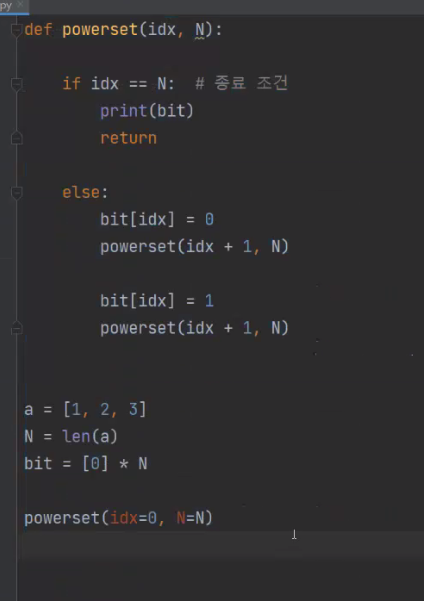

# 2022-02-23-2

- 그래프 순회 방법

  - DFS (깊이 먼저) : 스택으로 구현 가능
    - 갈 수 있는 곳까지 최대한 깊게 들어감
  - BFS (너비 먼저) : 큐로 구현 가능
    - 그 자리에서 갈 수 있는 곳을 모두 감

- 백트래킹 실행순서, 트리 손으로 써보기

  - 

  - 일단 완전 탐색부터 하고, 문제에 맞는 조건 설정

  - ```python
    def powerset(idx, N):
    
        if idx == N:  # 종료 조건
            print(bit)
            return
    
        bit[idx] = 1
        powerset(idx + 1, N)
    
        bit[idx] = 0
        powerset(idx + 1, N)
    
    
    a = [0, 7, 2, 3]
    N = len(a)
    bit = [0] * N
    
    powerset(idx=0, N=N)
    ```

  - 