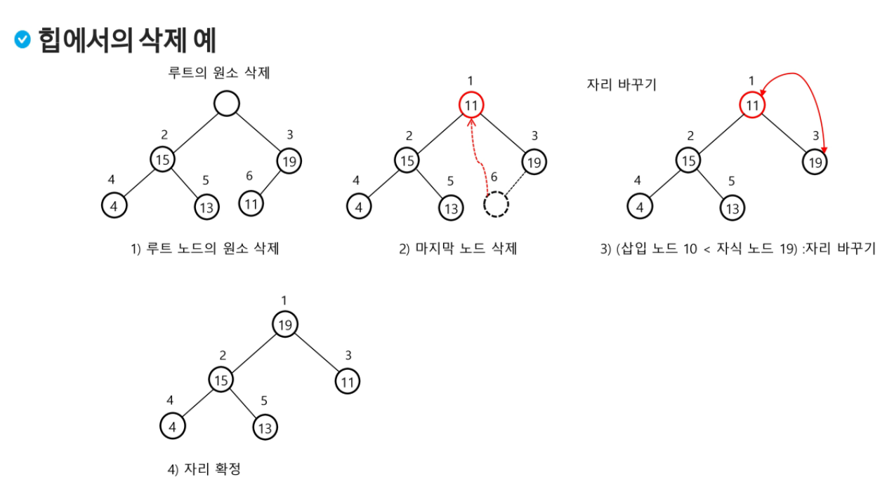

# 이진 트리

- 모든 노드들이 최대 2개의 서브 트리를 갖는 형태의 트리
- 각 노드가 자식 노드를 최대한 2개까지만 가질 수 있는 트리
- **포화 이진 트리**
  - 모든 레벨에 노드가 포화 상태로 채워져 있는 이진 트리
  - 높이 3일 때 노드 15개 (높이 h일 때 노드 2^(h+1)-1개)
  - 루트 노드 1번
- **완전 이진 트리**
  - 마지막 정점 노드까지는 빈칸이 없는 이진 트리
  - 루트 노드 1번
- **편향 이진 트리**
  - 최소 개수의 노드를 가지면서 한쪽 방향의 자식 노드만을 가진 이진 트리


## 순회

- **전위 순회**

  - ```python
    def preorder_traverse(Tree T):
        if T is not null:
            visit(T)
            preorder_traverse(T.left)
            preorder_traverse(T.right)
    ```

- **중위 순회**

  - ```python
    def inorder_traverse(Tree T):
        if T is not null:
            inorder_traverse(T.left)
            visit(T)
            inorder_traverse(T.right)
    ```

- **후위 순회**

  - ```python
    def postorder_traverse(Tree T):
        if T is not null:
            postorder_traverse(T.left)
            postorder_traverse(T.right)
            visit(T)
    ```


## 트리의 표현

- **배열★**
  - 루트의 번호를 1로 부여
  - 레벨 n에 있는 노드에 대하여 왼쪽부터 오른쪽으로 2^n부터 2^(n+1)-1까지 번호를 차례로 부여
  - **노드 번호의 성질** (포화이진트리 / 완전이진트리에서만 가능)
    - 노드 번호가 i인 노드의 부모 노드 번호 : i // 2
    - 노드 번호가 i인 노드의 왼쪽 자식 노드 번호 : 2 * i
    - 노드 번호가 i인 노드의 오른쪽 자식 노드 번호 : 2 * i + 1
    - 레벨 n의 노드 번호 시작 번호 : 2^n


## 이진 탐색 트리★

- **왼쪽 서브 트리 < 루트 노드 < 오른쪽 서브 트리**
- **중위 순회**하면 오름차순으로 정렬된 값을 얻을 수 있다

- **탐색 연산**
  - 루트에서 탐색 시작
  - 탐색할 키 값 x를 루트 노드의 키 값 k와 비교
    - x == k : 탐색 성공
    - x < k : 루트 노드의 왼쪽 서브 트리에 대해서 탐색 연산 수행
    - x > k : 루트 노드의 오른쪽 서브 트리에 대해서 탐색 연산 수행

- **삽입 연산**
  - 탐색 연산 먼저
    - 삽입할 원소와 같은 원소가 트리에 있는지 탐색하여 확인
    - 탐색 실패가 결정되는 위치가 삽입 위치

  - 탐색 실패한 위치에 원소 삽입

  - 

- **삭제 연산**

  - 삭제할 노드가 리프 노드인 경우

    - 그냥 삭제

  - 삭제할 노드가 리프 노드가 아닌 경우

    - 차수가 1인 경우
      - 탐색 후 삭제
      - 후속 처리 : 서브 트리 이동
      - 
    - 차수가 2인 경우
      - 탐색 후 후보 찾기 (왼쪽 서브트리에서 가장 큰 애)
      - 이동
      - 

    

# 힙★

## 최대 힙

- 키 값이 가장 큰 노드를 찾기 위한 **완전 이진 트리**
- **부모 노드의 키 값 > 자식 노드의 키 값**
- 루트 노드 : 키 값이 가장 큰 노드

- **삽입**

  - 마지막 정점 추가 및 저장

  - 부모와 비교를 하며  부모가 더 클 때까지 혹은 부모가 없을 때까지 부모와 자리 바꿔주기

  - **문제**

    - 비어있는 트리에 3, 2, 4, 7, 5, 1을 하나씩 순차적으로 삽입했을 때, 배열에 어떻게 저장되는지 순차적으로 작성하시오. (정답은 맨 밑에)

  - ```python
    # 교재에는 없지만 라이브에서는 나온 코드
    
    def enq(n):
        global last
        last += 1	# 마지막 정점 추가
        tree[last] = n	# 완전 이진 트리 유지
        c = last	# 새로 추가된 정점을 자식으로
        p = c // 2	# 완전 이진 트리에서의 부모 정점 번호
        while p >= 1 and tree[p] < tree[c]:	# 부모가 있고, 자식의 키 값이 더 크면 교환
            tree[p], tree[c] = tree[c], tree[p]
            c = p
            p = c // 2
    ```

  - 

  - 

- **삭제**

  - 힙에서는 루트 노드의 원소만을 삭제할 수 있다

  - ```python
    # 교재에는 없지만 라이브에서는 나온 코드
    
    def deq():
        global last
        tmp = tree[1]	# 루트의 key 값
        tree[1] = tree[last]	# 마지막 정점의 키를 루트에 복사
        last -= 1	# 마지막 정점 삭제
        # 부모 > 자식 규칙 유지
        p = 1
        c = p * 2
        while c <= last:	# 왼쪽 자식이 있으면
            if c + 1 <= last and tree[c] < tree[c + 1]:	# 오른쪽 자식 노드도 있고 더 크면
                c += 1	# 오른쪽 자식 선택
            if tree[p] < tree[c]:	# 자식의 키 값이 더 크면 교환
                tree[p], tree[c] = tree[c], tree[p]
                p = c
                c = p * 2
            else:
                break
        return tmp
    ```

  - 

     - 자식이 더 작아질 때까지 부모랑 자리를 바꿔준다


## 최소 힙

- 키 값이 가장 작은 노드를 찾기 위한 **완전 이진 트리**
- **부모 노드의 키 값 < 자식 노드의 키 값**
- 루트 노드 : 키 값이 가장 작은 노드


---

# 정답

- **[0, 3]** - **[0, 3, 2]** - ([0, 3, 2, 4]) - **[0, 4, 2, 3]** - ([0, 4, 2, 3, 7] - [0, 4, 7, 3, 2]) - **[0, 7, 4, 3, 2]** - ([0, 7, 4, 3, 2, 5]) - **[0, 7, 5, 3, 2, 4]** - **[0, 7, 5, 3, 2, 4, 1]**
  - (괄호 안에 있는 건 자리 바뀌기 전)