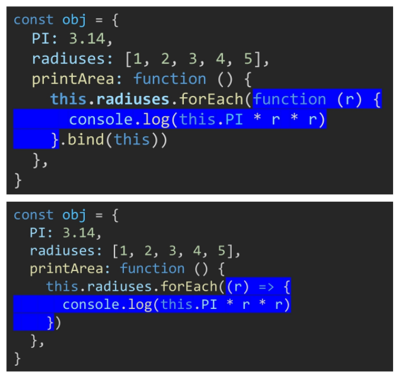

# 2022-04-25

# javascript 기초

# 1. Intro

### 브라우저

- URL로 웹을 탐색하며 서버와 통신하고, HTML 문서나 파일을 출력하는 GUI 기반의 소프트웨어
- 인터넷의 컨텐츠를 검색 및 열람하도록 함
- **JavaScript의 필요성**
  - 브라우저 화면을 동적으로 만들기 위함
  - 브라우저를 조작할 수 있는 유일한 언어

---

# 2. Browser

### 브라우저에서 할 수 있는 일

- **DOM (Document Object Model) 조작**
- **BOM (Browser Object Model) 조작**
- **JavaScript Core (ECMAScript)**

=> 브라우저(BOM)과 그 내부의 문서(DOM)를 조작하기 위해 ECMAScript(JS) 사용


### DOM이란?

- HTML, XML과 같은 문서를 다루기 위한 프로그래밍 인터페이스
- 문서를 구조화하고, 구조화된 구성 요소를 하나의 객체로 취급하여 다루는 논리적 트리 모델
- 문서가 객체로 구조화되어 있으며 key로 접근 가능
- 단순한 속성 접근, 메서드 활용, 프로그래밍 언어적 특성을 활용한 조작 가능
- 주요 객체
  - window : DOM을 표현하는 창(브라우저 탭) / 최상위 객체
  - document : 페이지 컨텐츠의 Entry Point 역할을 하며, `<head>`, `<body>`등 다른 요소들 포함
- **파싱**
  - 구문 분석, 해석
  - 브라우저가 문자열을 해석하여 DOM Tree로 만드는 과정


### BOM이란?

- Browser Object Model
- 자바스크립트가 브라우저와 소통하기 위한 모델
- 브라우저의 창이나 프레임을 추상화해서 프로그래밍적으로 제어할 수 있도록 제공하는 수단
- window 객체는 모든 브라우저로부터 지원받으며 브라우저의 창(window)을 지칭


## JavaScript Core

- 브라우저(DOM & BOM)을 조작하기 위한 명령어 약속(언어)

---

# 3. 변수와 식별자

### 식별자

- 변수를 구분할 수 있는 변수명
- 문자, $, _ 로 시작
- 대소문자 구분, 클래스명 외에는 모두 소문자로 시작
- **식별자 작성 스타일**
  - **카멜 케이스** : 변수, 객체, 함수에 사용 (camelCase)
  - **파스칼 케이스** : 클래스, 생성자에 사용 (PascalCase)
  - **대문자 스네이크 케이스** : 상수(변경될 가능성이 없는 값)에 사용 (SNAKE_CASE)


### 변수

- 변수 선언 키워드

  - **`let`**
    - **재할당 예정**인 변수 선언 시 사용
    - 변수 **재선언 불가능**
    - 블록 스코프
  - **`const`**
    - **재할당 예정이 없는** 변수 선언 시 사용
    - 변수 **재선언 불가능**
    - 블록 스코프
  - **`var`**
    - **재선언 및 재할당** 모두 가능
    - **호이스팅**되는 특성으로 인해 문제 발생 가능
      - 변수를 선언 이전에 참조할 수 있는 현상
      - 변수 선언 이전의 위치에서 접근 시 undefined를 반환
    - 함수 스코프
      - 함수의 중괄호 내부
      - 함수 스코프를 가지는 변수는 **함수 바깥에서 접근 불가능**

- **선언 / 할당 / 초기화**

  - **선언** : 변수를 생성하는 행위, 시점 (`let foo`)
  - **할당** : 선언된 변수에 값을 저장하는 행위, 시점 (`foo = 11`)
  - **초기화** : 선언된 변수에 처음으로 값을 저장하는 행위, 시점 (`let bar = 0`)

- **블록 스코프**

  - if, for, 함수 등의 **중괄호 내부**

  - 블록 스코프를 가지는 변수는 **블록 바깥에서 접근 불가능**

  - ```javascript
    let x = 1
    if (x === 1) {
        let x = 2
        console.log(x) // 2
    }
    console.log(x) // 1
    ```


---

# 4. 데이터 타입

- **원시 타입 (Primitive type)**
  - **Number**
  - **Srting**
  - **Boolean**
  - undefined
  - null
  - Symbol
- **참조 타입 (Reference type)**
  - **Objects**
    - **Array**
    - **Function**


### 원시 타입

- **객체가 아닌** 기본 타입

- 변수에 해당 타입의 **값**이 담김

- 다른 변수에 복사할 때 실제 값이 복사됨

- **Number**

  - 정수, 실수 구분 없음 (무한대 : Infinity)
  - 부동소수점 형식을 따름
  - NaN (Not-A-Number) : 계산 불가능한 경우 반환되는 값

- **String**

  - 텍스트 데이터를 나타냄
  - 템플릿 리터럴 (백틱 사용)
    - `const fullName = '${firstName} ${lastName}'`

- **Boolean**

  - 논리적 참 또는 거짓을 나타냄

  - true 또는 false로 표현

  - 조건문 또는 반복문에서 boolean이 아닌 데이터 타입은 **자동 형변환 규칙**에 따라 true 또는 false로 변환됨

  - | 데이터 타입 |    거짓    |        참        |
    | :---------: | :--------: | :--------------: |
    |  undefined  | 항상 거짓  |        -         |
    |    null     | 항상 거짓  |        -         |
    |   Number    | 0, -0, NaN | 나머지 모든 경우 |
    |   String    | 빈 문자열  | 나머지 모든 경우 |
    |   Object    |     -      |     항상 참      |

    

- **undefined**

  - 변수의 값이 없음을 나타냄
  - 변수 선언 이후 직접 값을 할당하지 않으면, 자동으로 할당
  - `typeof undefined // undefined`

- **null**

  - 변수의 값이 없음을 의도적으로 표현할 때 사용
  - `typeof null // object`


### 참조 타입

- **객체 타입**의 자료형
- 변수에 해당 객체의 **참조 값**이 담김
- 다른 변수에 복사할 때 참조 값이 복사됨

---

# 5. 연산자

### 할당 연산자

- +=, -=, *=, /=
- Increment 및 Decrement 연산자
  - Increment(++) : 피연산자의 값을 1 증가시키는 연산자
  - Decrement(--) : 피연산자의 값을 1 감소시키는 연산자


### 비교 연산자

- <, >
- 피연산자들을 비교하고 결과값을 boolean으로 반환하는 연산자
- 문자열은 유니코드 값 사용, 표준 사전 순서를 기반으로 비교
  - 알파벳 순서상 후순위가 더 큼
  - 소문자가 대문자보다 큼


### 동등 비교 연산자 (==)

- 두 피연산자가 같은 값으로 평가되는지 비교 후 boolean 값을 반환
- **암묵적 타입 변환**을 통해 타입을 일치시킨 후 같은 값인지 비교
- 두 피연산자가 모두 객체일 경우 메모리의 같은 객체를 바라보는지 판별


### 일치 비교 연산자 (===)

- 두 피연산자가 같은 값으로 평가되는지 비교 후 boolean 값을 반환
- **엄격한 비교**가 이뤄짐 => 두 비교 대상의 **타입과 값 모두** 같은지 비교
- 두 피연산자가 모두 객체일 경우 메모리의 같은 객체를 바라보는지 판별


### 논리 연산자

- && : and
- || : or
- ! : not
- 단축 평가 지원


### 삼항 연산자

- 세 개의 피연산자를 사용하여 조건에 따라 값을 반환

- 가장 왼쪽의 조건식이 참이면 : 앞의 값을 사용, 거짓이면 : 뒤의 값을 사용

- 변수에 할당 가능

- ```javascript
  console.log(true ? 1 : 2) // 1
  console.log(false ? 1 : 2) // 2
  
  const result = Math.PI > 4 ? 'Yes' : 'No'
  console.log(result) // No
  ```

----

# 6. 조건문

### if

- 조건 표현식의 결과값을 Boolean 타입으로 변환 후 참 / 거짓 판단

- 블록 스코프 생성

- ```javascript
  const nation = 'Korea'
  
  if (nation === 'Korea') {
      console.log('안녕하세요')
  } else if (nation === 'France') {
      console.log('Bonjour')
  } else {
      console.log('Hello')
  }
  ```


### switch

- **표현식의 결과값**과 **case 문의 오른쪽 값**을 비교

- 주로 특정 변수의 값에 따라 조건을 분기할 때 사용

  - 조건이 많아질 경우 if문보다 가독성이 나을 수 있음

- break 및 default문은 선택적으로 사용 가능

- break문이 없는 경우 break문을 만나거나 default문을 실행할 때까지 다음 조건문 실행

- 블록 스코프 생성

- break가 있는 경우

  - ```javascript
    const nation = 'Korea'
    
    switch(nation) {
        case 'Korea': {
            console.log('안녕하세요')
            break
        }
        case 'France': {
            console.log('Bonjour')
            break
        }
        default: {
            console.log('Hello')
        }
    }
    // 안녕하세요
    ```

- break가 없는 경우

  - ```javascript
    const nation = 'Korea'
    
    switch(nation) {
        case 'Korea': {
            console.log('안녕하세요')
        }
        case 'France': {
            console.log('Bonjour')
        }
        default: {
            console.log('Hello')
        }
    }
    // 안녕하세요
    // Bonjour
    // Hello
    ```

---

# 7. 반복문

### while

- 조건문이 true일 동안 반복 시행

- 블록 스코프 생성

- ```javascript
  let i = 0
  
  while (i < 6) {
      console.log(i) // 0, 1, 2, 3, 4, 5
      i += 1
  }
  ```


### for

- ```javascript
  for (initilization; condition; expression) {
  }
  ```

- initialization : 최초 반복문 진입 시 1회만 실행되는 부분

- condition : 매 반복 시행 전 평가되는 부분

- expression : 매 반복 시행 이후 평가되는 부분

- 블록 스코프 생성

- ```javascript
  for (let i = 0; i < 6; i++) {
      console.log(i) // 0, 1, 2, 3, 4, 5
  }
  ```


### for ... in

- **객체**의 **속성(key)**들을 순회할 때 사용

- 배열도 순회 가능하지만 인덱스 순으로 순회한다는 보장이 없으므로 권장하지 않음

- 블록 스코프 생성

- ```javascript
  const capitals = {
      korea: 'seoul',
      france: 'paris',
      USA: 'washington D.C.'
  }
  
  for (let capital in capitals) {
      console.log(capital)
  }
  // korea, france, USA
  ```


### for ... of

- **반복 가능한 객체**를 순회하며 **값**을 꺼낼 때 사용 (Array, Map, Set, String)

- 블록 스코프 생성

- ```javascript
  const fruits = ['딸기', '바나나', '메론']
  
  for (let fruit of fruits) {
      console.log(fruit)
  }
  // 딸기, 바나나, 메론
  ```

---

# 8. 함수

- 함수 정의 방법
  - **함수 선언식**
  - **함수 표현식**
- typeof 연산자의 결과는 function
- JavaScript의 함수는 **일급 객체**에 해당
  - 변수에 할당 가능
  - 함수의 매개변수로 전달 가능
  - 함수의 반환 값으로 사용 가능


### 함수 선언식

- 함수의 이름과 함께 정의하는 방식

- 함수의 이름 + 매개변수 + 몸통

- 호이스팅 O

- ```javascript
  function add(num1, num2) {
      return num1 + num2
  }
  ```


### 함수 표현식

- 함수를 표현식(어떤 하나의 값으로 결정되는 코드의 단위) 내에서 정의하는 방식

- **익명 함수**로 정의 가능

- 함수의 이름(생략 가능) + 매개변수 + 몸통

- 호이스팅 X

- ```javascript
  const add = function (num1, num2) {
      return num1 + num2
  }
  ```


### 특징

- **인자 작성 시 ' = ' 문자 뒤 기본 인자 선언 가능**

  - ```javascript
    const greeting = function (name = 'Anonymous') {
        return `Hi ${name}`
    }
    
    greeting() // Hi Anonymous
    ```

- **매개변수와 인자의 개수 불일치 허용**

  - 매개변수 개수 < 인자의 개수

    - ```javascript
      const twoArgs = function (arg1, arg2) {
          return [arg1, arg2]
      }
      
      twoArgs(1, 2, 3) // [1, 2]
      ```

  - 매개변수 개수 > 인자의 개수

    - ```javascript
      const threeArgs = function (arg1, arg2, arg3) {
          return [arg1, arg2, arg3]
      }
      
      threeArgs(1, 2) // [1, 2, undefined]
      ```

- **Rest Parameter (...)**

  - 정해지지 않은 수의 매개변수를 배열로 받음

  - ```javascript
    const restOpr = function (arg1, arg2, ...restArgs) {
        return [arg1, arg2, restArgs]
    }
    
    restArgs(1, 2, 3, 4, 5) // [1, 2, [3, 4, 5]]
    restArgs(1, 2) // [1, 2, []]
    ```

- **Spread Operator (...)**

  - 배열 인자를 전개하여 전달 가능

  - ```javascript
    const spreadOpr = function (arg1, arg2, arg3) {
        return arg1 + arg2 + arg3
    }
    
    const numbers = [1, 2, 3]
    spreadOpr(...numbers) // 6
    ```

---

# 9. Arrow Function

- ```javascript
  const arrow1 = function (name) {
      return `hello, ${name}`
  }
  
  // 1. function 키워드 삭제
  const arrow2 = (name) => {return `hello, ${name}`}
  
  // 2. 매개변수가 1개일 경우에만 () 생략 가능
  const arrow3 = name => {return `hello, ${name}`}
  
  // 3. 함수 body가 return을 포함한 표현식 1개일 경우에 {} & return 삭제
  const arrow4 = name => `hello, ${name}`
  ```

---

# 10. 문자열

### 문자열 관련 주요 메서드

- **includes**

  - `string.includes(value)`

  - 문자열에 value가 존재하는지 판별 후 참 / 거짓 반환

  - ```javascript
    const str = 'a santa at nasa'
    str.includes('santa') // true
    str.includes('asan') // false
    ```

- **split**

  - `string.split(value)`

  - ```javascript
    const str = 'a cup'
    str.split() // ['a cup']
    str.split('') // ['a', ' ', 'c', 'u', 'p']
    str.split(' ') // ['a', 'cup']
    ```

- **replace**

  - `string.replace(from, to)`

  - `string.replaceAll(from, to)`

  - ```javascript
    const str = 'a b c d'
    str.replace(' ', '-') // 'a-b c d'
    str.replaceAll(' ', '-') // 'a-b-c-d'
    ```

- **trim**

  - `string.trim()` : 문자열 시작과 끝의 모든 공백문자(스페이스, 탭, 엔터 등)를 제거한 문자열 반환

  - `string.trimStart()`

  - `string.trimEnd()`

  - ```javascript
    const str = '     hello     '
    str.trim() // 'hello'
    str.trimStart() // 'hello     '
    str.trimEnd() // '     hello'
    ```

---

# 11. 배열

- 키와 속성들을 담고 있는 **참조 타입의 객체**
- 순서를 보장함
- 배열의 길이는 `array.length` 형태로 접근 가능

### 배열 관련 주요 메서드 (1)

- **reverse**

  - `array.reverse()`

  - 원본 배열의 요소들의 순서를 반대로 정렬

  - ```javascript
    const numbers = [1, 2, 3, 4, 5]
    numbers.reverse()
    console.log(numbers) // [5, 4, 3, 2, 1]
    ```

- **push & pop**

  - `array.push()`: 배열의 가장 뒤에 요소 추가
  - `array.pop()`: 배열의 마지막 요소 제거

- **unshift & shift**

  - `array.unshift()`: 배열의 가장 앞에 요소 추가
  - `array.shift()`: 배열의 첫번째 요소 제거

- **includes**

  - `array.includes(value)`: 배열에 특정 값이 존재하는지 판별 후 참 또는 거짓 반환

- **indexOf**

  - `array.indexOf(value)`
    - 배열에 특정 값이 존재하는지 확인 후 가장 **첫번째**로 찾은 요소의 **인덱스** 반환
    - 만약 해당 값이 없을 경우 -1 반환

- **join**

  - `array.join([separator])`

    - 배열의 모든 요소를 연결하여 반환
    - separator는 선택적으로 지정 가능, 생략 시 쉼표를 기본 값으로 사용

  - ```javascript
    const numbers = [1, 2, 3, 4, 5]
    let result
    
    result = numbers.join()
    console.log(result) // 1,2,3,4,5
    
    result = numbers.join(' ')
    console.log(result) // 1 2 3 4 5
    ```

- **Spread Operator (...)**

  - 배열 내부에서 배열 전개 가능

  - 얕은 복사에 활용 가능

  - ```javascript
    const array = [1, 2, 3]
    const newArray = [0, ...array, 4]
    
    console.log(newArray) // [0, 1, 2, 3, 4]
    ```


### 배열 관련 메서드 (2)

- 배열을 순회하며 특정 로직을 수행하는 메서드

- 메서드 호출 시 인자로 **callback 함수**를 받음

  - callback 함수 : 어떤 함수의 내부에서 실행될 목적으로 인자로 넘겨받는 함수

- **forEach**

  - 배열의 각 요소에 대해 콜백 함수를 한 번씩 실행

  - 콜백 함수의 3가지 매개변수

    - element / index / array

  - **반환 값이 없는 메서드**

  - ```javascript
    const fruits = ['딸기', '수박', '사과', '체리']
    
    fruits.forEach((fruit, index) => {
        console.log(fruit, index)
        // 딸기 0
        // 수박 1
        // 사과 2
        // 체리 3
    })
    ```

- **map**

  - 배열의 각 요소에 대해 콜백 함수를 한 번씩 실행

  - 콜백 함수의 **반환값을 요소로 하는 새로운 배열 반환**

  - 기존 배열 전체를 다른 형태로 바꿀 때 유용

  - ```javascript
    const numbers = [1, 2, 3, 4, 5]
    
    const doubleNums = numbers.map((num) => {
        return num * 2
    })
    
    console.log(doubleNums) // [2, 4, 6, 8, 10]
    ```

- **filter**

  - 배열의 각 요소에 대해 콜백 함수를 한 번씩 실행

  - 콜백 함수의 **반환값이 참인 요소들만 모아서 새로운 배열 반환**

  - 기존 배열의 요소들을 필터링할 때 유용

  - ```javascript
    const numbers = [1, 2, 3, 4, 5]
    
    const oddNums = numbers.filter((num, index) => {
        return num % 2
    })
    
    console.log(oddNums) // [1, 3, 5]
    ```

- **reduce**

  - 배열의 각 요소에 대해 콜백 함수를 한 번씩 실행

  - 콜백 함수의 **반환값들을 하나의 값(acc)에 누적 후 반환**

  - 주요 매개변수

    - acc : 이전 콜백 함수의 반환값이 누적되는 변수
    - initialValue (optional) : 최초 콜백 함수 호출 시 acc에 할당되는 값, default 값은 배열의 첫 번째 값
      - 빈 배열의 경우 제공하지 않으면 에러 발생

  - ```javascript
    const numbers = [1, 2, 3]
    
    const result = numbers.reduce((acc, num) => {
        return acc + num
    }, 0)
    
    console.log(result) // 6
    ```

- **find**

  - 배열의 각 요소에 대해 콜백 함수를 한 번씩 실행

  - 콜백 함수의 **반환 값이 참이면, 조건을 만족하는 첫번째 요소를 반환**

  - 찾는 값이 배열에 없으면 undefined 반환

  - ```javascript
    const avengers = [
        {name: 'Tony', age: 45},
        {name: 'Steve', age: 32},
        {name: 'Thor', age: 40}
    ]
    
    const result = avengers.find((avenger) => {
        return avenger.name === 'Tony'
    })
    
    console.log(result) // {name: 'Tony', age: 45}
    ```

- **some**

  - 배열의 **요소 중 하나라도** 주어진 판별 함수를 통과하면 참을 반환
  - 모든 요소가 통과하지 못하면 거짓 반환
  - 빈 배열은 항상 거짓 반환

- **every**

  - 배열의 **모든 요소가** 주어진 판별 함수를 통과하면 참을 반환
  - 하나의 요소라도 통과하지 못하면 거짓 반환
  - 빈 배열은 항상 참 반환

- 배열 순회 방법 비교
  - for 
    - 인덱스를 활용하여 배열의 요소에 접근
    - break, continue 사용 가능
  - for ... of
    - 인덱스 없이 배열의 요소에 바로 접근 가능
    - break, continue 사용 가능
  - forEach
    - break, continue 사용 불가능

---

# 12. 객체

- 속성의 집합
- 중괄호 내부에 key와 value 쌍으로 표현
  - key : **문자열** 타입만 가능 / 이름에 구분자가 있으면 따옴표로 묶어서 표현
  - value : **모든 타입 (함수 포함)** 가능
- 객체 요소 접근은 점 또는 대괄호로 가능
  - key 이름에 구분자가 있으면 대괄호 접근만 가능


### 객체와 메서드

- 메서드 : 객체의 속성이 참조하는 함수

- **메서드 내부**에서는 `this` 키워드가 **객체**를 의미

  - ```javascript
    const me = {
        firstName: 'John',
        lastName: 'Doe',
        
        fullName: this.firstName + this.lastName,
        // 메서드가 아니므로 정상 출력되지 않음
        
        getFullName: function () {
            return this.firstNmae + this.lastName
            // JohnDoe
        }
    }
    ```


### 객체 관련 ES6 문법

- **속성명 축약**

  - 객체를 정의할 때 **key와 할당하는 변수의 이름이 같으면** 축약 가능

  - ```javascript
    var bookShop = {
        books: books,
        magazines: magazines,
    }
    
    // ES6+
    const bookShop = {
        books,
        magazines,
    }
    ```

- **메서드명 축약**

  - 메서드 선언 시 **function 키워드 생략 가능**

    -  ```javascript
       var obj = {
           greeting: function () {
               console.log('Hi!')
           }
       }
       
       // ES6+
       const obj = {
           greeting() {
               console.log('Hi!')
           }
       }
       ```

- **계산된 속성**

  - 객체를 정의할 때 key의 이름을 표현식을 이용하여 동적으로 생성 가능

  - ```javascript
    const key = 'regions'
    const value = ['광주', '대전', '구미', '서울']
    
    const ssafy = {
        [key]: value,
    }
    
    console.log(ssafy) // {regions: Array(4)}
    console.log(ssafy.regions) // ['광주', '대전', '구미', '서울']
    ```

- **구조 분해 할당 (중요)**

  - 배열 또는 객체를 분해하여 속성을 변수에 쉽게 할당할 수 있는 문법

  - ```javascript
    const name = userInformation.name
    const userId = userInformation.userId
    
    // ES6+
    const {name} = userInformation
    const {userId} = userInformation
    
    // 여러 개도 가능
    const {name, userId} = userInformation
    ```

- **Spread Operator (...)**

  - 객체 내부에서 객체 전개 가능

  - 얕은 복사에 활용 가능

  - ```javascript
    const obj = {b: 2, c: 3, d: 4}
    const newObj = {a: 1, ...obj, e: 5}
    
    console.log(newObj) // {a: 1, b: 2, c: 3, d: 4, e: 5}
    ```


### JSON

- key - value 쌍의 형태로 데이터를 표기
- 자바스크립트의 객체와 유사하게 생겼으나 실제로는 **문자열 타입**
  - JS의 객체로써 조작하기 위해서는 **parsing**이 필수
- JSON을 조작하기 위한 자바스크립트의 내장 메서드
  - `JSON.parse()`: JSON => 자바스크립트 객체
  - `JSON.stringify()`: 자바스크립트 객체 => JSON

---

# 13. this

- 실행 문맥에 따라 다른 대상을 가리킴
  - class 내부의 생성자 함수 : 생성되는 객체
  - 메서드 : 해당 메서드가 소속된 객체
  - 나머지는 모두 최상위 객체 window
- **function 키워드와 화살표 함수 차이**
  - 
    - `this.radiuses`: 메서드 소속이기 때문에 정상적으로 접근 가능
    - 콜백함수 내부의 `this`는 window가 되어 `this.PI`는 정상적으로 접근 불가능
    - 콜백함수 내부에서 `this.PI`에 접근하기 위해서 `함수객체.bind(this)` 메서드 사용
    - 이 과정을 없앤 것이 화살표 함수

---

# 14. lodash

- CDN import를 통해 _ 식별자 사용 가능

- ```javascript
  _.sample([1, 2, 3, 4]) // 3 랜덤한 1개의 원소 추출
  _.sampleSize([1, 2, 3, 4], 2) // [1, 3] 랜덤한 2개의 원소 추출
  
  _.reverse([1, 2, 3, 4]) // [4, 3, 2, 1]
  
  _.range(5) // [0, 1, 2, 4]
  _.range(1, 5) // [1, 2, 3, 4]
  _.range(1, 5, 2) // [1, 3]
  ```
