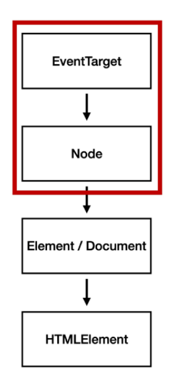

# 2022-04-27

- 브랜던 아이크 : JavaScript 최초 설계자
- 2015년 ES6 탄생 => JavaScript의 고질적인 문제들을 해결

# 1. DOM 조작

- Document는 문서 한 장(HTML)에 해당하고 이를 조작
- DOM 조작 순서
  1. **선택**
  2. **변경**

### DOM 관련 객체의 상속 구조

- **EventTarget** : Event Listener를 가질 수 있는 객체가 구현하는 DOM 인터페이스
- **Node** : 여러 가지 DOM 타입들이 상속하는 인터페이스
- **Element** : Document 안의 모든 객체가 상속하는 가장 범용적인 인터페이스
- **Document** : 브라우저가 불러온 웹 페이지 / DOM 트리의 진입점 역할
- **HTMLElement** : 모든 종류의 HTML 요소

### DOM 선택 관련 메서드

- **`document.querySelector(selector)`**
  - 제공하는 선택자와 일치하는 **하나의 element** 선택
  - 제공한 CSS selector를 만족하는 첫 번째 element 객체를 반환 (없으면 null)
- **`document.querySelectorAll(selector)`**
  - 제공한 선택자와 일치하는 **여러 element** 선택
  - 지정된 선택자와 일치하는 **NodeList**를 반환
    - **HTMLCollection & NodeList**
      - **HTMLCollection** : name, id, index 속성으로 각 항목에 접근 가능
      - **NodeList** : index로만 각 항목에 접근 가능
        - `forEach` 메서드 및 다양한 메서드 사용 가능
      - 둘 다 Live Collection으로 DOM의 변경사항을 실시간으로 반영
  - Static Collection으로 실시간으로 반영되지 않음
    - **Collection**
      - **Live Collection**
        - 문서가 바뀔 때 실시간으로 업데이트 됨
        - DOM의 변경사항을 실시간으로 collection에 반영
        - HTML Collection, NodeList
      - **Static Collection**
        - DOM이 변경되어도 collection 내용에는 영향을 주지 않음
        - `querySelectorAll()`의 반환 NodeList
- 다른 메서드에 비해서 더 구체적이고 유연하게 선택 사능
  - id(`'#id'`), class(`'.class'`), tag 선택자 등을 모두 사용 가능

### DOM 변경 관련 메서드

- **`document.createElement()`**
  - 작성한 태그 명의 HTML 요소를 생성하여 반환
- **`Element.append()`**
  - 특정 부모 Node의 자식 NodeList 중 마지막 자식 다음에 Node 객체나 DOMString 삽입
  - 여러 개 추가 가능
  - 반환 값이 없음
- **`Node.appendChild()`**
  - 한 Node를 특정 부모 Node의 자식 NodeList 중 마지막 자식으로 삽입(Node만 추가 가능)
  - 한번에 오직 하나의 Node만 추가할 수 있음
  - 추가된 Node 객체를 반환
- **`Node.innerText`**
  - Node 객체와 그 자손의 텍스트 컨텐츠(DOMString)를 표현(해당 요소 내부의 raw text)
  - 최종적으로 스타일링이 적용된 모습으로 표현
- **`Element.innerHTML`**
  - Element 내에 포함된 HTML 마크업을 반환
  - XSS 공격에 취약하므로 사용 시 주의
    - 공격자가 입력 요소를 사용하여 웹 사이트 클라이언트 측 코드에 악성 스크립트를 삽입해 공격하는 방법
    - 피해자의 브라우저가 악성 스크립트를 실행하며 공격자가 엑세스 제어를 우회하고 사용자를 가장

### DOM 삭제 관련 메서드

- **`ChildNode.remove()`**
  - Node가 속한 트리에서 해당 Node를 제거
- **`Node.removeChild()`**
  - DOM에서 자식 Node를 제거하고 제거된 Node를 반환
  - Node는 인자로 들어가는 자식 Node의 부모 Node

### DOM 속성 관련 메서드

- **`Element.setAttribute(name, value)`**
  - 지정된 요소의 값을 설정
  - 속성이 이미 존재하면 값을 갱신, 존재하지 않으면 지정된 이름과 값으로 새 속성을 추가
- **`Element.getAttribute(attributeName)`**
  - 해당 요소의 지정된 값(문자열) 반환
  - 인자는 값을 얻고자 하는 속성의 이름을 넣어줌

---

# 2. Event

- 네트워크 활동이나 사용자와의 상호작용 같은 사건의 발생을 알리기 위한 객체
- **Event 기반 인터페이스**
  - UIEvent
    - 간단한 사용자 인터페이스 이벤트
    - Event의 상속을 받음
    - MouseEvent, KeyboardEvent, InputEvent, FocusEvent 등의 부모 객체 역할

### Event handler

- 대상에 특정 이벤트가 발생하면, 할 일을 등록하자
- **`EventTarget.addEventListener()`**
  - 지정한 이벤트가 대상에 전달될 때마다 호출할 함수를 설정
  - 이벤트를 지원하는 모든 객체(Element, Document, WIndow 등)를 대상으로 지정 가능
- **`target.addEventListener(type, Listener)`**
  - `type`
    - 반응할 이벤트 유형
  - `listener`
    - 지정된 타입의 이벤트가 발생했을 때 알림을 받는 객체
    - EventListener 인터페이스 혹은 JS function 객체(콜백 함수)여야 함

### Event 취소

- **`event.preventDefault()`**
  - 현재 이벤트의 기본 동작을 중단
  - HTML 요소의 기본 동작을 작동하지 않게 막음
    - a 태그 : 클릭 시 링크로 이동
    - form 태그 : form 데이터 전송
- 취소할 수 없는 이벤트도 존재

