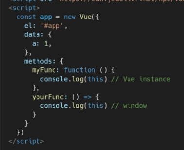
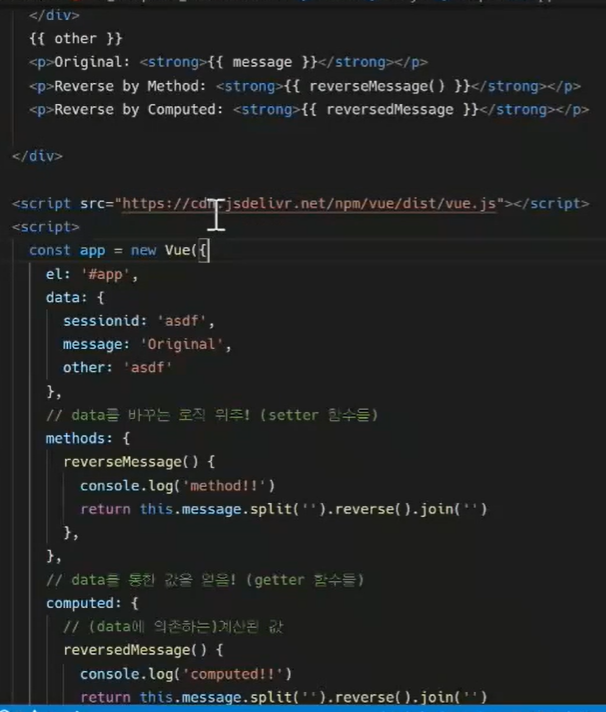
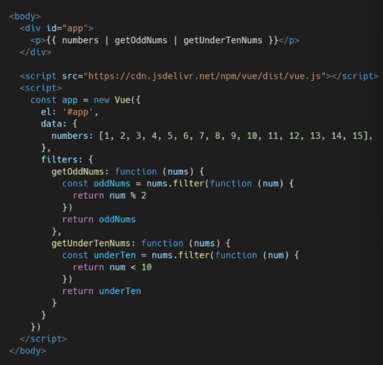

# Vue

# 1. 

## (1) Intro

### Vue.js

- 사용자 인터페이스를 만들기 위한 진보적인 자바스크립트 프레임워크

- 현대적인 tool과 다양한 라이브러리를 통해 **SPA(Single Page Application)**를 완벽 지원

- Evan You

- DOM과 Data가 연결되어 있고, Data를 변경하면 이에 연결된 DOM은 알아서 변경

  (Vanilla JS는 그렇지 않음..)

### SPA (Single Page Application)

- 현재 페이지를 동적으로 렌더링함으로써 사용자와 소통하는 웹 애플리케이션
- **단일 페이지**로 구성되며 서버로부터 최초에만 페이지를 다운로드하고, 이후에는 동적으로 DOM 구성
  - 현재 페이지 중 필요한 부분만 동적으로 다시 작성
- 연속되는 페이지 간의 사용자 경험(UX) 향상
- 동작 원리의 일부가 CSR(Client Side Rendering)의 구조를 따름

### CSR (Client Side Rendering)

- 클라이언트에서 화면을 구성
- 최초 요청 시 HTML, CSS, JS 등 데이터를 제외한 각종 리소스를 응답받고 이후 클라이언트에서는 **필요한 데이터만 요청해 JS로 DOM을 렌더링하는 방식**
- 장점
  - 서버와 클라이언트 간 트래픽 감소
    - 웹 애플리케이션에 필요한 모든 정적 리소스를 최초에 한 번 다운로드 후 필요한 데이터만 갱신
  - 사용자 경험 향상
    - 전체 페이지를 다시 렌더링하지 않고 변경되는 부분만을 갱신
- 단점
  - SSR에 비해 전체 페이지 최종 렌더링 시점이 느림
  - SEO(검색 엔진 최적화)에 어려움이 있음(최초 문서에 데이터 마크업이 없음)
- **SSR**
  - Server Side Rendering
  - 서버에서 클라이언트에게 보여줄 페이지를 모두 구성하여 전달하는 방식
  - 장단점은 CSR과 반대
- **SSR & CSR**
  - 최종 HTML(실제 브라우저에 그려질 HTML) 생성 주체가 누구인가에 따라 결정
    - 서버 => SSR
    - 클라이언트 => CSR


## (2) Vue.js

### MVVM Pattern

- 애플리케이션 로직을 UI로부터 분리하기 위해 설계된 디자인 패턴
- **Model**
  - Object === { key : value }
  - Vue Instance 내부에서 data라는이름으로 존재
  - 이 데이터가 바뀌면 View(DOM)가 반응
- **View**
  - DOM(HTML)
  - Data의 변화에 따라서 바뀌는 대상
- **VIewModel**
  - Vue Instance
  - View와 Model 사이에서 Data와 DOM에 관련된 모든 일을 처리
  - ViewModel을 활용해 Data를 얼마만큼 잘 처리해서 보여줄 것인지(DOM)를 고민하는 것


## (3) Basic syntax of Vue.js

- ```vue
  const app = new Vue({
  	el: '#app',
  	data: {
  		message: 'Hello',
  	},
  	methods: {
  		greeting: function () {
  			console.log('hello')
  		}
  	}
  })
  ```

- **Vue instance**

  - Vue 인스턴스를 생성할 때는 Options 객체를 전달해야 함
  - Vue Instance === Vue Component
  - **`el`**
    - Vue 인스턴스에 연결(마운트)할 기존 DOM 요소가 필요
    - CSS 선택자 문자열 혹은 HTML Element로 작성
    - new를 이용한 인스턴스 생성 때만 사용
  - **`data`**
    - Vue 인스턴스의 데이터 객체
    - Vue 인스턴스의 상태 데이터를 정의하는 곳
    - Vue template에서 interpolation({{ }})을 통해 접근 가능
    - v-bind, v-on과 같은 directive에서도 사용 가능
    - Vue 객체 내 다른 함수에서 this 키워드를 통해 접근 가능
  - **`methods`**
    - Vue 인스턴스에 추가할 메서드
    - Vue template에서 interpolation을 통해 접근 가능
    - v-on과 같은 directive에서도 사용 가능
    - Vue 객체 내 다른 함수에서 this 키워드를 통해 접근 가능
      - **화살표 함수 사용 불가** => **1. data / 2. method 정의**
      - 화살표 함수가 부모 컨텍스트를 바인딩하기 때문에, `this`는 Vue 인스턴스가 아님
      - `this` : Vue 함수 객체 내에서 vue 인스턴스를 가리킴
      - 


## (4) Template Syntax

### Interpolation

- Text : `{{ msg }}`

### Directive

- v-접두사가 있는 특수 속성
- 표현식의 값이 변경될 때 반응적으로 DOM에 적용하는 역할을 함
- 전달인자 `:` 를 통해 전달인자를 받을 수 있음
- 수식어 `.` directive를 특별한 방법으로 바인딩해야 함
- **v-text**
  - `<p v-text="message"></p>`
  - `<p>{{ message }}</p>`와 같음
  - 엘리먼트의 textContent를 업데이트
- **v-html**
  - `<p v-html="myHtml"></p>`
  - 엘리먼트의 innerHTML을 업데이트(XSS 공격에 취약할 수 있음)
  - 임의로 사용자로부터 입력받은 내용은 절대 사용 금지
- **v-show**
  - `<p v-show="isTrue">TRUE</p>`
  - `<p v-show="isFalse">FALSE</p>`
  - 요소는 **항상 렌더링**되고 DOM에 남아있음
  - 단순히 엘리먼트에 display CSS 속성을 토글하는것(아예 없는 것이 아니고, 안 보이게 설정)
- **v-if, v-else-if, v-else**
  - directive의 표현식이 **true일 때만 렌더링**
  - 엘리먼트 및 포함된 directive는 토글하는 동안 삭제되고 다시 작성됨
- v-show와 v-if
  - **v-show(Expensive initial load, cheap toggle)**
    - CSS display 속성을 hidden으로 만들어 토글
    - 딱 한 번만 렌더링이 되는 경우라면 v-if에 비해 상대적으로 렌더링 비용이 높음
    - 자주 변경되는 요소하면 한 번 렌더링 된 이후부터는 보여주는지에 대한 여부만 판단하면 되기 때문에 토글 비용이 적음
  - **v-if(Cheap initial load, expensive toggle)**
    - 전달인자가 false인 경우 렌더링되지 않음
    - 렌더링 자체가 되지 않기 때문에 렌더링 비용이 낮음
    - 자주 변경되는 요소의 경우 다시 렌더링 해야하므로 비용이 증가할 수 있음
- **v-for**
  - `<div v-for="fruit in fruits">{{ fruit }}</div>`
  - `<div v-for="(fruit, idx) in fruits">{{ idx }} : {{ fruit }}</div>`
  - `<div v-for="todo in todos">{{ todo.title }} : {{ todo.completed }}</div>`
  - `<div v-for="(value, key) in myObj">{{ key }} => {{ value }}</div>`
  - 반드시 **key 속성**(독립적인 값)을 각 요소에 작성
    - v-bind 사용
  - v-if와 함께 사용하는 경우 v-for가 우선순위가 더 높음(가능하면 동시에 사용하지 말 것)
- **v-on**
  - `<button v-on:click="doAlert">Button</button>`
  - `<button @click="doAlert">Button</button>`
  - 엘리먼트에 이벤트 리스너를 연결
  - 이벤트 유형은 전달인자로 표시함
  - 특정 이벤트가 발생했을 때, 주어진 코드(methods)가 실행됨
    - 첫번째 인자는 event
- **v-bind**
  - ``
  - ``
    - HTML 요소의 속성에 Vue의 상태 데이터를 값으로 할당
  - `<div :class>="{ active: isRed }"</div>` 
    - isRed가 true이면 active 라는 class 적용
    - Object 형태로 사용하면 value가 true인 key가 class 바인딩 값으로 할당
  - `<div :class>="[activeRed, myBackGround]"</div>` 
    - 여러 class를 배열 안에 넣어 할당 가능
- **v-model**
  - `<input v-model="myMessage" type="text"></input>`
  - HTML form(input) 요소의 값과 data를 양방향 바인딩
    - 하나의 값이 바뀌면 다른 값에 적용됨
  - `.lazy` : input 대신 change 이벤트 이후에 동기화
  - `.numner` : 문자열을 숫자로 변경
  - `.trim` : 입력에 대한 trim을 진행
- **computed** (getter)
  - 데이터를 기반으로 하는 **계산된 속성**
  - 함수의 형태로 정의하지만 함수가 아닌 **함수의 반환 값**이 바인딩 됨(반드시 반환값이 있어야 함)
  - 종속된 데이터에 따라 저장됨
  - **종속된 데이터가 변경될 때만 함수를 실행**
  - **methods** (setter)
    - 데이터의 종속여부와 상관없이 렌더링을 다시 할 때마다 항상 함수를 실행
    - 

- **watch**
  - **특정 값이 변동하면 다른 작업을 한다**
  - 데이터에 변화가 일어났을 때 실행되는 함수
  - 특정 데이터의 변화 상황에 맞춰 다른 data 등이 바뀌어야 할 때 주로 사용
  - 명령형 프로그래밍 => 데이터가 바뀌면 특정 함수 실행
  - **computed**
    - **특정 값이 변동하면 해당 값을 다시 계산해서 보여준다**
    - 특정 데이터를 직접적으로 사용/가공하여 다른 값으로 만들 때 사용
    - 선언형 프로그래밍 => 계산해야 하는 목표 데이터를 정의
- **filter**
  - 텍스트 형식화를 적용할 수 있는 필터
  - interpolation 혹은 v-bind를 이용할 때 가능
  - chaining 가능
  - 


## (5) Lifecycle Hooks

- 각 Vue 인스턴스는 생성될 때 일련의 초기화 단계를 거침
- **created** : vue 인스턴스가 생성된 후 호출
  - 애플리케이션의 초기 데이터를 API 요청을 통해 불러올 수 있음
- **mounted / updated / destroyed**

---

# 2.

## (1) SFC (Single File Component)

- **Component**
  - 기본 HTML 엘리먼트를 확장하여 재사용 가능한 코드를 캡슐화하는데 도움을 줌
  - 쉬운 유지보수, 재사용 가능
  - Vue 컴포넌트 === Vue 인스턴스
- **SFC**
  - Vue 컴포넌트 기반 개발의 핵심 특징
  - 하나의 컴포넌트는 .vue 확장자를 가진 하나의 파일 안에서 작성되는 코드의 결과물
  - HTML, CSS, JavaScript 코드를 하나의 파일에서 관리
  - Vue 컴포넌트 === Vue 인스턴스 === .vue 파일
- **Vue 컴포넌트**
  - 한 화면 안에서도 기능 별로 각기 다른 컴포넌트가 존재
    - 하나의 컴포넌트는 여러 개의 하위 컴포넌트를 가질 수 있음
    - Vue는 컴포넌트 기반의 개발 환경 제공
  - Vue 컴포넌트는 `const app = new Vue({})`의 app을 의미
    - 컴포넌트 기반의 개발이 반드시 파일 단위로 구분되어야 하는 것은 아님


## (2) Vue CLI

### Vue CLI

- Vue.js 개발을 위한 표준 도구

### Node.js

- 자바스크립트를 브라우저가 아닌 환경에서도 구동할 수 있도록 하는 자바스크립트 런타임 환경
- 단순히 브라우저만 조작할 수 있던 자바스크립트를 SSR 아키텍처에서도 사용할 수 있도록 함

### NPM (Node Package Manage)

- 자바스크립트 언어를 위한 패키지 관리자(Node.js의 기본 패키지 관리자)
- pip와 마찬가지로 다양한 의존성 패키지 관리


## (3) Babel & webpack

### Babel

- **JavaScript compiler**
- 자바스크립트의 ECMAScript 2015+ 코드를 이전 버전으로 번역/변환해주는 도구

### Webpack

- **static module bundler**
- 모듈 간의 의존성 문제를 해결하기 위한 도구
- 프로젝트에 필요한 모든 모듈을 매핑하고 내부적으로 종속성 그래프를 빌드
- **module**
  - 파일 하나
  - 모듈 의존성 문제
    - 모듈의 수가 많아지고 라이브러리/모듈 간의 의존성이 깊어지면서 특정한 곳에서 발생한 문제가 어떤 모듈 간의 문제인지 파악하기 어려움
- **bundler**
  - bundling : 모듈 의존성 문제를 해결해주는 작업
  - Webpack은 다양한 Bundler 중 하나
  - 여러 모듈을 하나로 묶어주고 묶인 파일은 하나로 합쳐짐
  - 더 이상 순서에 영향을 받지 않고 동작

### Vue 프로젝트 구조

- node_modules
  - node.js 환경의 여러 의존성 모듈
- public/index.html
  - Vue 앱의 뼈대가 되는 파일
  - 실제 제공되는 **단일 html 파일**
- src/assets
  - webpack에 의해 빌드된 정적 파일
- src/components
  - 하위 컴포넌트들이 위치
- src/App.vue
  - 최상위 컴포넌트
- src/main.js
  - webpack이 빌드를 시작할 때 가장 먼저 불러오는 entry point
  - 실제 단일 파일에서 DOM과 data를 연결했던 것과 동일한 작업이 이루어지는 곳
  - Vue 전역에서 활용할 모듈을 등록할 수 있는 파일
- babel.config.js
  - babel 관련 설정이 작성된 파일
- package.json
  - 프로젝트의 종속성 목록와 지원되는 브라우저에 대한 구성 옵션이 포함
- package-lock.json
  - node_modules에 설치되는 모듈과 관련된 모든 의존성을 설정 및 관리
  - 사용할 패키지의 버전을 고정
  - 개발 과정 간의 의존성 패키지 충돌 방지


## (4) Pass props & Emit events

### 컴포넌트 작성

- Vue app은 자연스럽게 중첩된 컴포넌트 트리로 구성됨

- 컴포넌트 간 부모-자식 관계로 구성, 의사소통 필요

- 부모 -- **pass props** --> 자식 : 데이터 전달

  부모 <-- **emit event** -- 자식 : 메시지를 보냄

### 컴포넌트 구조

1. 템플릿(HTML)
2. 스크립트(JavaScript)
3. 스타일(CSS)
