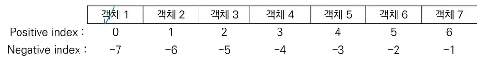
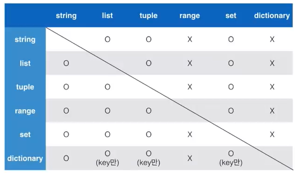
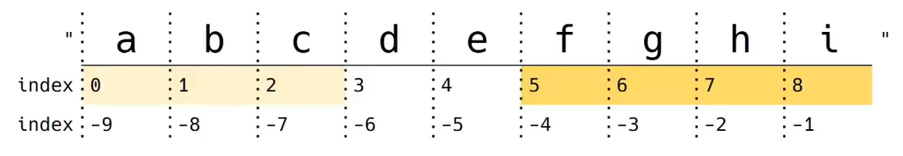

# 2022-01-17

# 1. Python 기초

## 1. 컴퓨터 프로그래밍 언어

- **컴퓨터 프로그래밍 언어** : 컴퓨터에게 명령하기 위한 약속
  - **컴퓨터** : calculation + remember
  - **프로그래밍**
    - program : 일련의 명령어의 모음(집합)
  - **언어**
    - 자신의 생각을 나타내고 전달하기 위해 사용하는 체계
    - 문법적으로 맞는 말의 집합
    - 언어 공동체 내에서 이해될 수 있는 말의 집합
- 선언적 지식 : 사실에 대한 내용
- **명령적 지식** : how to -> 컴퓨터 프로그래밍 언어에서 주로 사용


## 2. 파이썬 개발 환경

### (1) 파이썬이란?

- **Easy to learn**
  - 다른 프로그래밍 언어보다 문법이 간단하면서도 엄격하지 않음
    - 예시) 변수에 별도의 타입 지정이 필요 없음
  - 문법 표현이 매우 간결하여 프로그래밍 경험이 없어도 짧은 시간 내에 마스터 할 수 있음
    - 예시) 문장을 구분할 때 중괄호 대신 들여쓰기를 사용
- **Expressive Language**
  - 같은 작업에 대해서도 C나 자바로 작성할 때보다 더 간결하게 작성 가능
- **크로스 플랫폼 언어**
  - 윈도우즈, macOS, 리눅스, 유닉스 등 다양한 운영체제에서 실행 가능

### (2) 파이썬의 특징

- **인터프리터 언어**
  - 소스코드를 기계어로 변환하는 컴파일 과정 없이 바로 실행 가능
  - 코드를 대화하듯 한 줄 입력하고 실행한 후, 바로 확인할 수 있음

### (3) 파이썬 개발환경 종류

- **대화형 환경**
  - 파이썬 기본 Interpreter
  - Jupyter Notebook -> 실습 때 많이 사용
- **스크립트 실행** -> 금요일 / 평가 때 많이 사용
  - .py 파일을 작성하고, IDE 혹은 Text Editor 사용
  - 파이썬 프로그램 파일의 확장자명 : .py


### (4)  파이썬 기본 인터프리터 : **IDLE**

- 내장 프로그램으로 파이썬 설치 시 기본적으로 설치

  -> 인터프리터가 대화형 모드로 동작함

  - 여러 줄의 코드가 작성되는 경우 보조 프롬프트(...)가 사용됨
  - 프롬프트(>>>)에 코드를 작성하면 해당 코드가 실행됨

- Python이 설치된 환경에서는 기본적으로 활용 가능하나 디버깅 및 코드 편집, 반복 실행이 곤란

### (5) **Jupyter Lab** : IDLE의 확장판 

- 웹 브라우저 환경에서 코드를 작성할 수 있는 오픈소스
  - Syntax Highlighting, Indentation, Tab completion 등 편의 기능 제공함
  - 브라우저에서 코드를 실행하고 결과를 확인할 수 있음
  - HTML, LaTex, PNG, SVG을 바탕으로 다양한 표현이 가능
  - Markdown을 기반으로 문서를 작성할 수 있음

- 데이터분석 / 머신러닝 / 딥러닝 시 많이 활용 가능하며, Google colab 등 유사한 환경의 서비스도 있음

### (6) Python 스크립트 실행

- IDE (예시 : Pycharm), Text editor (예시 : VS code) 등에서 작성한 파이썬 스크립트 파일을 직접 실행
  - IDE : 통합개발환경 / 하나의 언어에 대해서 전문적
  - Text editor : 메모장의 확장판 / 모든 언어의 코드를 작성할 수 있음

### (7) 파이썬 프로그램 구성 단위

- **식별자**
  - 변수, 함수, 클래스 등 프로그램이 실행되는 동안 다양한 값을 가질 수 있는 이름
  - 예약어
    - 파이썬 키워드 (명령어)
- **리터럴**
  - 읽혀지는 대로 쓰여있는 값 그 자체
- **표현식**
  - 새로운 데이터 값을 생성하거나 계산하는 코드 조각
- **문장**
  - 특정한 작업을 수행하는 코드 전체
  - 파이썬이 실행 가능한 최소한의 코드 단위
  - 표현식은 값을 생성하는 일부분이고, 문장은 특정작업을 수행하는 코드 전체
  - 모든 표현식은 문장이다.
- **함수**
  - 특정 명령을 수행하는 묶음
- **모듈**
  - 함수 / 클래스의 모음 또는 하나의 프로그램을 구성하는 단위
- **패키지**
  - 프로그램과 모듈 묶음
    - 프로그램 : 실행하기 위한 것
    - 모듈 : 다른 프로그램에서 불러와 사용하기 위한 것
- **라이브러리**
  - 패키지 모음


## 3. 기초 문법

### (1) 코드 스타일 가이드

- 코드를 '어떻게 작성할지'에 대한 가이드라인
- 파이썬에서 제안하는 스타일 가이드 
  - **PEP8** -> 일관적인 코드 작성 스타일
- 기업, 오픈소스 등에서 사용되는 스타일 가이드
  - Google Style guide

### (2) 들여쓰기(Indentation)

- Space Sensitive
  - 문장을 구분할 때, {} 대신 들여쓰기를 사용
  - 들여쓰기를 할 때는 **4칸** 공백
    - **주의!** 한 코드 안에서는 반드시 한 종류의 들여쓰기를 사용 -> 혼용하면 안됨
      - Tab로 들여쓰면 계속 Tab으로 들여써야 함
      - 원칙적으로는 공백 사용을 권장

### (3) 변수(Variable)

- 어떻게 저장하고, 이름 지을까?

- **"이름" = "값"** ( = : **할당**)

- 박스 안에 값을 넣는다!

- **변수란?**

  - 컴퓨터 메모리 어딘가에 저장되어 있는 객체를 참조하기 위해 사용되는 이름

    - **객체(object)** : 숫자, 문자, 클래스 등 값을 가지고 있는 모든 것 = things

      -> 파이썬은 **객체지향 언어**이며, 모든 것이 객체로 구현되어 있음


  - 동일 변수에 다른 객체를 언제든 할당할 수 있기 때문에,

    즉, 참조하는 객체가 바뀔 수 있기 때문에 '변수'라고 불림

- 변수는 할당 연산자(=)를 통해 값을 할당(assignment)

- **`type()`** : 변수에 할당된 값의 타입 -> **변수 활용의 핵심!!**

- `id()` : 변수에 할당된 값(객체)의 고유한 아이덴티티 값이며, 메모리 주소

### (4) 변수 연산

- 숫자 + 숫자 -> 덧셈
- 문자 + 문자 -> 문자를 연결
- 문자 * 숫자 -> 문자를 숫자만큼 반복해서 연결

### (5) 변수 할당

- 같은 값을 동시에 할당할 수 있음

  ```python
  >>> x = y = 1004
  >>> print(x, y)
  1004 1004
  ```

- 다른 값을 동시에 할당할 수 있음

  ```python
  >>> x, y = 1, 2
  >>> print(x, y)
  1 2
  ```

- 실습 문제

  - x = 10, y = 20일 때, 각각 값을 바꿔서 저장하는 코드를 작성하시오

  - ```python
    #1. 임시 변수 활용 - 권장!
    >>> tmp = x
    >>> x = y
    >>> y = tmp
    >>> print(x, y)
    20 10
    ```

  - ```python
    #2. Pythonic!
    >>> x, y = 10, 20
    >>> y, x = x, y
    >>> print(x, y)
    20 10
    ```

### (6) 식별자(Identifiers)

- 변수(박스)의 이름을 어떻게 지을 수 있을까?

- 파이썬 객체(변수, 함수, 모듈, 클래스 등)를 식별하는데 사용하는 이름

- 규칙

  - 식별자의 이름은 영문 알파벳, 언더스코어(_), 숫자로 구성

  - 첫 글자에 숫자가 올 수 없음

  - 길이 제한이 없고, 대소문자를 구별

  - 다음의 키워드는 예약어로 사용할 수 없음

    - False, None, True, and, as, assert, async, await, break, class, continue, def, del, elif, else, except, finally, for, from, global, if, import, in, is, lambda, nonlocal, not, or, pass, raise, return, try, while, with, yield

  - RedApple : Camel Case

    red_apple  : Snake Case <- 권장!

  - 내장함수나 모듈 등의 이름으로도 만들면 안됨

    - 기존의 이름에 다른 값을 할당하게 되므로 더 이상 동작하지 않음

### (7) 사용자 입력 

- 코테 / 알고리즘 문제 풀이에 많이 사용
- **`input([prompt])`**
  - 사용자로부터 값을 즉시 입력 받을 수 있는 내장함수
  - 대괄호 부분에 문자열을 넣으면 입력 시, 해당 문자열을 출력할 수 있음
  - 반환값은 항상 문자열의 형태로 반환

### (8) 주석(Comment)

- **한 줄 주석**
  - 주석으로 처리될 내용 앞에 '#'을 입력
    - 한 줄을 온전히 사용할 수도 있고, 그 줄 코드 뒷부분에 작성할 수 있음
- **여러 줄의 주석**
  - 한 줄씩 #을 사용하거나, """ 또는 ''' 으로 표현
    - """ 또는 ''' 으로 표현하는 방법은 docstring을 위해 사용
  - VS code에서는 'ctrl + /'
- **특수한 형태의 주석 - docstring**
  - 함수 / 클래스의 설명을 작성


## 4. 파이썬 자료형

### (1) 자료형 분류

- 데이터 타입 : Boolean / Numeric / String type
  - **Boolean** : True / False
  - **Numeric** : Int / Float / Complex
  - **String** : 문자열
  - **None** 

### (2) None

- 값이 없음을 표현하기 위한 타입

### (3) Boolean

- True / False 값을 가진 타입은 bool
- 비교 / 논리 연산을 수행함에 있어서 활용됨
- 다음은 모두 False로 반환
  - 0, 0.0, (), [], {}, '', None
- `bool()` 함수
  - 특정 데이터가 True인지 False인지 검증
  - bool([0]) = True

### (4) 수치형 (Numeric)

- **정수 (Int)**

  - 모든 정수의 타입은 int
    - Python 3부터는 long 타입은 없고, 모두 int로 표기됨
    - 여타 프로그래밍 언어, Python 2에서는 OS기준 32/64비트
  - 매우 큰 수를 나타낼 때 오버플로우가 발생하지 않음
    - 오버플로우 : 데이터 타입별로 사용할 수 있는 메모리의 크기를 넘어서는 상황
    - Arbitrary precision arithmetic(임의 정밀도 산술) 을 통해 고정된 형태의 메모리가 아닌 가용 메모리들을 활용하여 모든 수 표현에 활용
  - 진수 표현
    - 2진수 : 0b / 0b10 = 2
    - 8진수 : 0o / 0o30 = 24
    - 16진수 : 0x / 0x10 = 16

- **실수(Float)**

  - 정수가 아닌 모든 실수는 float 타입

  - 부동소수점

    - 실수를 컴퓨터가 표현하는 방법 - 2진수(비트)로 숫자를 표현

    - 이 과정에서 **floating point rounding error**가 발생하여, 예상치 못한 결과가 발생

      - 부동소수점에서 실수 연산 과정에서 발생 가능

        - 값 비교하는 과정에서 정수가 아닌 실수인 경우 주의할 것

        - ```python
          # 왼쪽의 계산 결과와 오른쪽 값은 같은 값일까요?
          >>> 3.14 - 3.02 == 0.12
          False
          ```

        - ```python
          >>> 3.14 - 3.02
          0.12000000000000001
          ```

        - **매우 작은 수보다 작은지를 확인하거나 math 모듈 활용**

        - ```python
          #1. 임의의 작은 수
          >>> abs(a - b) <= 1e - 10
          True
          
          #2. system 상의 machine epsilon
          >>> import sys
          >>> print(abs(a - b) <= sys.float_info.epsilon)
          >>> print(sys.float_info.epsilon)
          True
          2.220446049250313e-16
          
          #3. Python 3.5 이상
          >>> import math
          >>> math.isclose(a, b)
          True
          ```

- **복소수**

  - 실수부와 허수부로 구성된 복소수는 모두 complex 타입
    - 허수부를 j로 표현

### (5) 문자열(String Type)

- 모든 문자는 str 타입

- 문자열은 작은따옴표나 큰따옴표를 활용하여 표기

  - 문자열을 묶을 때 동일한 문장부호를 활용
  - PEP8에서는 소스코드 내에서 하나의 문장부호를 선택하여 유지하도록 함

- **Immutable** : 특정 값 하나만 바꿀 수 없다

- **Iterable** : 반복해서 수행 가능

- **중첩따옴표(Nested Quotes)**

  - 따옴표 안에 따옴표를 표현할 경우

    - 작은 따옴표가 들어 있는 경우는 큰 따옴표로 문자열 생성

    - 큰 따옴표가 들어 있는 경우는 작은 따옴표로 문자열 생성

- **삼중따옴표(Triple Quotes)**

  - 작은 따옴표나 큰 따옴표를 삼중으로 사용
    - 따옴표 안에 따옴표를 넣을 때
    - 여러 줄을 나눠 입력할 때 편리

- **Escape sequence**  

  - 문자열 내에서 특정 문자나 조작을 위해서 역슬래시(\)를 활용하여 구분

  - | 예약 문자 | 내용 (의미)     |
    | --------- | --------------- |
    | \n        | 줄 바꿈         |
    | \t        | 탭              |
    | \r        | 캐리지리턴      |
    | \o        | 널(Null)        |
    | \\        | \               |
    | \'        | 단일인용부호(') |
    | \"        | 이중인용부호(") |

- **String Interpolation** 
  - 문자열을 변수를 활용하여 만드는 법
    - %-formatting : 변수가 뒤에 작성되어 있음 / 거의 대부분의 프로그래밍 언어에서 사용
    
      - %s : 문자열
      - %d : 정수
      - %f : 실수
    
    - str.format() : 변수가 뒤에 작성되어 있음
      - `print('Hello, {}! 성적은 {}' .format (name, score))`
    
    - f-strings : python 3.6+ , 변수를 직관적으로 확인 가능
      - `print(f 'Hello, {name}! 성적은 {score}')`
    
      - ```python
        >>> import datetime
        >>> today = datetime.datetime.now()
        >>> print(today)
        2021-06-24 15:01:21.704852
        >>> f '오늘은 {today : %y}년 {today : %m}월 {today : %d}일'
        '오늘은 21년 06월 24일'
        ```
    
      - ```python
        >>> pi = 3.141592
        >>> f '원주율은 {pi:.3}, 반지름이 2일때 원의 넓이는 {pi*2*2}'
        '원주율은 3.14. 반지름이 2일때 원의 넓이는 12.566368'
        ```

### (6) None

- 파이썬 자료형 중 하나
- 파이썬에는 값이 없음을 표현하기 위해 None 타입이 존재함
- 일반적으로 반환값이 없는 함수에서 사용하기도 함

### 

## 5. 컨테이너 (Container)

### (1) 컨테이너의 정의

- 컨테이너란?
  - 여러 개의 값을 담을 수 있는 것(객체)으로, **서로 다른 자료형을 저장**할 수 있음
    - 예시) List, Tuple

### (2) 컨테이너의 분류

- **순서가 있는 데이터(Ordered)** VS **순서가 없는 데이터(Unordered)**
- 순서가 있다 != 정렬되어 있다.
- 순서가 없다 = 순서를 보장받지 못한다.
- **시퀀스형** : 순서가 있는 데이터
  - **리스트** : 가변형
  - **튜플** : 불변형
  - **레인지** : 불변형
- **비시퀀스형** : 순서가 없는 데이터
  - **세트** : 가변형
  - **딕셔너리** : 불변형

### (3) 리스트

- **리스트의 정의**

  - **순서를 가지는** 0개 이상의 객체를 참조하는 자료형
    - 생성된 이후 내용 변경이 가능 -> **가변자료형**
    - 유연성 때문에 파이썬에서 가장 흔히 사용
  - 항상 **대괄호 [ ]** 형태로 출력

- **생성과 접근**

  - ```python
    #1. 비어있는 리스트
    >>> mylist = []
    >>> another_list = list()
    >>> print(type(my_list))
    >>> print(type(another_list))
    <class 'list'>
    <class 'list'>
    
    #2. 값이 있는 리스트
    >>> location = ['서울', '대전', '구미', '광주', '부울경']
    >>> print(location)
    >>> print(type(location))
    ['서울', '대전', '구미', '광주', '부울경']
    <class 'list'>
    >>> location[0]
    '서울'
    ```

  - 리스트는 대괄호([ ]) 혹은 `list()`을 통해 생성

  - **순서가 있는 시퀀스**로 인덱스를 통해 **접근 가능**

    - 값에 대한 접근은 `list[i]`
    - 
    - 시작은 0, 끝은 -1

  - ```python
    >>> boxes = ['A', 'B', ['apple', 'banana', 'cherry']]
    >>> len(boxes)
    3
    
    >>> boxes[2]
    ['apple', 'banana', 'cherry']
    
    >>> boxes[2][-1]
    'cherry'
    
    >>> boxes[-1][1][0]
    'b'
    ```

### (4) 튜플(Tuple)

- **튜플의 정의**
  - **순서를 가지는** 0개 이상의 객체를 참조하는 자료형
    - 생성 후, 담고 있는 객체 변경이 불가 -> **불변 자료형**
  - 항상 **소괄호 ( )** 형태로 출력
- **생성과 접근**
  - 소괄호 (()) 혹은 `tuple()`을 통해 생성
  - **수정 불가능한 시퀀스**로 인덱스를 통해 **접근 가능**
    - 값에 대한 접근은 `my_tuple[i]`
  - 튜플 생성 주의사항
    - 단일 항목의 경우
      - 하나의 항목으로 구성된 튜플은 생성 시 값 뒤에 쉼표를 붙여야 함
      - (1,)
    - 복수 항목의 경우
      - 마지막 항목에 붙은 쉼표는 불필요
      - (1, 2, 3)
- **튜플 대입**
  - 튜플 대입이란?
    - 우변의 값을 좌변의 변수에 한번에 할당하는 과정
  - 튜플은 일반적으로 파이썬 내부에서 활용
    - 추후 함수에서 복수의 값을 반환하는 경우에도 활용

### (5) 레인지 (Range)

- **레인지의 정의**

  - 숫자의 시퀀스를 나타내기 위해 사용
    - 기본형 : `range(n)`
      - 0부터 n-1까지의 숫자의 시퀀스
    - 범위 지정 : `range(n, m)`
      - n부터 m-1까지의 숫자의 시퀀스
    - 범위 및 스텝 지정 : `range(n, m, s)`
      - n부터 m-1까지 s만큼 증가시키며 숫자의 시퀀스

- **레인지의 용도**

  - range는 숫자의 시퀀스를 나타내기 위해 사용

  - ```python
    #1. 0부터 특정 숫자까지
    >>> list(range(3))
    [0, 1, 2]
    
    #2. 숫자의 범위
    >>> list(range(1, 5))
    [1, 2, 3, 4]
    
    #3. step 활용
    >>> list(range(1, 5, 2))
    [1, 3]
    
    #4. 역순
    >>> list(range(6, 1, -1))
    [6, 5, 4, 3, 2]
    
    >>> list(range(1, 3, -1))
    []
    
    >>> list(range(6, 1, 1))
    []
    ```

### (6) 패킹 / 언패킹

- **패킹 / 언패킹 연산자**

  - 모든 시퀀스형(리스트, 튜플 등)은 패킹 / 언패킹 연산자 * 를 사용하여 객체의 패킹 또는 언패킹이 가능

  - **패킹**

    - 대입문의 좌변 변수에 위치

    - 우변의 객체 수가 좌변의 변수 수보다 많을 경우 객체를 순서대로 대입

    - 나머지 항목들은 모두 별 기호 표시된 변수에 리스트로 대입

    - ```python
      >>> x, *y = 1, 2, 3, 4
      >>> print(x)
      >>> type(x)
      1
      int
      >>> print(y)
      >>> type(y)
      [2, 3, 4]
      list
      ```

  - **언패킹**

    - argument 이름이 *로 시작하는 경우, argument unpacking이라 함
      - *패킹의 경우, 리스트로 대입
      - *언패킹의 경우, 튜플 형태로 대입

### (7) 셋 (Set)

- **셋의 정의**
  - **순서없이** 0개 이상의 해시가능한 객체를 참조하는 자료형
    - 해시 가능한 객체만 담을 수 있음
  - 담고 있는 객체를 삽입 변경, 삭제 가능 -> **가변자료형**
  - 수학에서의 집합과 동일한 구조를 가짐
    - 집합 연산이 가능
    - 중복된 값이 존재하지 않음
- **셋 생성**
  - 중복없이 순서가 없는 자료구조
    - 중괄호({ }) 혹은 `set()`을 통해 생성
      - 빈 set를 만들기 위해서는 `set()`을 반드시 활용해야 함
    - 순서가 없어 별도의 값에 접근할 수 없음
    - 중복 값 제거
    - 빈 중괄호는 dictionary
- **셋 활용**
  - 셋을 활용하면 다른 컨테이너에서 중복된 값을 쉽게 제거할 수 있음
    - 단, 이후 순서가 무시되므로 순서가 중요한 경우 사용할 수 없음
    - 순서를 보장 받을 수 없음

### (8) 딕셔너리 (Dictionary)

- **딕셔너리의 정의**
  - 순서 없이 키-값 (key-value) 쌍으로 이뤄진 객체를 참조하는 자료형
  - Dictionary의 **키 (key)**
    - 해시가능한 불변 자료형만 가능
    - list 들어갈 수 없음
    - 고유한 값
    - 중복 불가능
  - 각 키의 **값 (values)**
    - 어떠한 형태든 관계 없음
    - 중복 가능
- **딕셔너리 생성**
  - key와 value가 쌍으로 이뤄진 자료구조
    - key는 변경 불가능한 데이터만 활용 가능
      - string, integer, float, boolean, tuple, range
    - value는 모든 값으로 설정 가능
      - list, dictionary 등
  - 중괄호({ }) 혹은 `dict()`을 통해 생성
  - **key를 통해 value에 접근**
    - value로 key를 찾을 수는 없음

### (9) 형 변환 (Typecasting)

- **자료형 변환**

  - 파이썬에서 데이터 형태는 서로 변환할 수 없음
    - **암시적 형 변환**
      - 사용자가 의도하지 않고, 파이썬 내부적으로 자료형을 변환하는 경우
      - bool
      - Numeric type (int, float, complex)
    - **명시적 형 변환**
      - 사용자가 특정 함수를 활용하여 의도적으로 자료형을 변환하는 경우
      - int
        - str*, float => int (형식에 맞는 문자열만 가능)
        - `int('3') + 4`
      - float
        - str*, int => float (형식에 맞는 문자열만 가능)
        - `float('3')`
      - str
        - int, float, list, tuple, dict => str

- **컨테이너 형 변환**

  - 컨테이너 간의 형 변환은 아래와 같이 가능
  - 
    - range와 dictionary로 변환 불가능
      - dictionary로 변환하면 key만 나옴

  

## 6. 연산자 (Operator)

### (1) 산술 연산자

- 기본적인 사칙연산 및 수식 계산

- | 연산자     | 내용     |
  | ---------- | -------- |
  | +          | 덧셈     |
  | -          | 뺄셈     |
  | *          | 곱셈     |
  | /          | 나눗셈   |
  | //         | 몫       |
  | % (modulo) | 나머지   |
  | **         | 거듭제곱 |

### (2) 비교 연산자

- 값을 비교하며, True / False 값을 리턴함

- | 연산자 | 내용                        |
  | ------ | --------------------------- |
  | <      | 미만                        |
  | <=     | 이하                        |
  | >      | 초과                        |
  | >=     | 이상                        |
  | ==     | 같음                        |
  | !=     | 같지 않음                   |
  | is     | 객체 아이덴티티             |
  | is not | 객체 아이덴티티가 아닌 경우 |

### (3) 논리 연산자

- and / or / not

- 일반적으로 비교연산자와 함께 사용됨

- **논리 연산자 단축평가**

  - 결과가 확실한 경우 두 번째 값은 확인하지 않음

  - ```python
    >>> a = 5 and 4
    >>> print(a)
    4
    
    >>> b = 5 or 3
    >>> print(b)
    5
    
    >>> c = 0 and 5
    >>> print(c)
    0
    
    >>> d = 5 or 0
    >>> print(d)
    5
    ```

  - and 연산

    - 첫 번째 값이 False인 경우 무조건 False => 첫 번째 값 반환
    - 첫 번째 값이 True인 경우 두 번째 값을 확인해야 함 => 두 번째 값 반환

  - or 연산

    - 첫 번째 값이 True인 경우 무조건 True => 첫 번째 값 반환
    - 첫 번째 값이 False인 경우 두 번째 값을 확인해야 함 => 두 번째 값 반환

### (4) 복합 연산자

- 연산과 대입이 함께 이루어짐

  - 예시) 반복문을 통해서 개수를 카운트하는 경우

  - ```python
    >>> cnt = 100
    >>> cnt += 1
    >>> print(cnt)
    101
    ```

### (5) 식별 연산자

- is 연산자를 통해 동일한 객체인지 확인 가능함

### (6) 멤버십 연산자

- 포함 여부 확인
  - in
  - not in

### (7) 시퀀스형 연산자

- 산술연산자 (+)
  - 시퀀스 간의 연결 / 연쇄
  - 리스트, 튜플의 연결
  - range는 연산이 안된다고 보면 됨
- 반복연산자(*)
  - 시퀀스를 반복
  - 리스트, 튜플 반복 가능

### (8) 기타 : 인덱싱

- 시퀀스의 특정 인덱스 값에 접근
  - 해당 인덱스가 없는 경우 IndexError

### (9) 기타 : 슬라이싱

- 시퀀스를 특정 단위로 슬라이싱
- 시퀀스를 k 간격으로 슬라이싱
- 

- `s[2 : 5] => 'cde'`

  `s[-6 : -2] => 'defg'`

  `s[2 : -4] => 'cde'` : 웬만하면 안씀

  `s[2 : 5 : 2] =>'ce'`

  `s[ : 3] => 'abc'`

  `s[5 : ] => 'fghi'`

  `s[ : : ] => 'abcdefghi'` : tricky~

  - `s[0 : len(s) : 1]`과 동일

  `s[ : : -1] => 'ihgfedcba'` : tricky~

  - `s[-1 : -(len(s)+ 1 ) : -1]` 과 동일

### (10) 기타 : set 연산자

- | : 합집합
- & : 교집합
- -: 여집합
- ^ : 대칭차집합

### (11) 연산자 우선 순위

- ()
- slicing
- indexing
- **
- 단항 연산자 (+, -) : 부호
- 산술 연산자 (*, /, %)
- 산술 연산자 (+, -)
- 비교 연산자, in, is
- not
- and
- or

# 4. 제어문

- 제어문
  - 파이썬은 기본적으로 위에서 아래로 순차적으로 명령을 수행
  - 특정 상황에 따라 코드를

# 5. 조건문

- **조건문**

  - 참 / 거짓을 판단할 수 있는 조건식과 함께 사용
  - if / else : 들여쓰기 주의 (4 space 사용)
  - **:** 까먹으면 안됨
  - input 함수는 자료형을 정해줘야 함 -> 기본 베이스 : str
  - 비어있으면 False, 차있으면 True 임을 이용해서 조건을 구성하기도 함

- **복수 조건문**

  - 복수의 조건식을 활용할 경우 elif를 활용하여 표현함

    ```python
    if <expression>:
        # Code block
    elif <expression>:
        # Code block
    else :
        # Code block
        # 조건을 넣을 수 없음
    ```

- **중첩 조건문**

- **조건 표현식**

  - 조건 표현식을 일반적으로 조건에 따라 값을 정할 때 활용

  - `value = num if num >= 0 else -num`

    - num이 0 이상이면 num을 그대로 쓸 것이고, 아니면 부호를 바꾼다

    - ```python
      num = 3
      if num >= 0:
          value = num
      else:
          value = -num
      print(value)
      ```

  - ```python
    # 실습 문제
    if num >= 0:
        value = num
    else :
        value = 0
    ```

# 6. 반복문

- 반복문 : 특정 조건을 도달할 때까지

## 1. While 문

- 조건식이 참인 경우 반복적으로 코드를 실행

  - 조건이 참인 경우 들여쓰기 되어 있는 코드 블록이 실행됨

- a = 0 

  a = 1 

  a = 2

  a = 3

  a = 4

  끝

- python tutor에서 한줄씩 실행하는 것 확인 가능
- 초기화 변수 설정 중요

## 2. For 문

- 시퀀스를 포함한 순회가능한 객체 요소를 모두 순회함

- ```python
  for fruit in ['apple', 'mango', 'banana']:
      # fruit = 'apple'
      print(fruit)
      # fruit = 'mango'
      print(fruit)
      # fruit = 'banana'
      print(fruit)
  의 형식으로 반복됨
  ```

- 사용자가 입력한 문자를 한 글자씩 출력하시오

  ```python
  #1. 단순히 순회하는 방식 (중요!)
  chars = input()
  for char in chars:
      print(char)
  ```

  ```python
  #2. 인덱스로 접근하여 0~길이-1 반복 (중요!)
  chars = input()
  for inx in range(len(chars)):
      print(idx, chars[idx])
  ```

- **딕셔너리 순회**

  - 기본적으로 key를 순회하며, key를 통해 값을 활용

  - 추가 메서드를 활용하여 순회할 수 있음

    - `keys()` : Key로 구성된 결과
    - `values()` : value로 구성된 결과
    - `items()` : (Key, value)의 튜플로 구성된 결과

  - ```python
    grades = {'kim' : 80, 'lee' : 100}
    
    #1. 딕셔너리 순회 => key
    for key in grades:
        print(key, grades[key])
    
    #2. keys
    for key in grades.keys():
        print(key, grades[key])
     
    #3. values
    for value in grades.values():
        print(value)
        
    #4. items
    for key, value in grades.items():
        #key, value = ('kim', 80)
        print(key, value)
    ```

- **enumerate 순회**

  - 인덱스와 객체를 쌍으로 담은 열거형 객체 반환
  - `start = 1`을 통해서 1부터 시작하게 할 수도 있음

- List comprehension

  - 표현식과 제어문을 통해 특정한 값을 가진 

  - 1~3의 세제곱의 결과가 담긴 리스트를 만드시오.

    ```python
    cubic_list = []
    for number in range(1,4):
        cubic_list.append(number**3)
    cubic_list
    ```

  - ```python
    # 1~30까지 숫자 중에 (반복)
    # 홀수만 (조건)
    for i in range(1, 31):
        if i % 2 == 1:
            print(i)
    # 1-1. 빈통
    numbers = []
    for i in range(1, 31):
        if i % 2 == 1:
            numbers.append(i)
    print(numbers)
    
    numbers_2 = [i for i in range(1, 31) if i % 2 == 1]
    print(numbers_2)
    ```

- **반복문 제어**

  - break

    - break문을 만나면 반복문은 종료됨
    - 특정 조건에 반복문을 종료시키기 위해서는 break!

  - continue

    - continue 이후의 코드 블록은 수행하지 않고, 다음 반복을 수행

  - for-else

    - 끝까지 반복문을 실행한 이후에 else문 실행

    - else 문은 break로 중단되었는지 여부에 따라 실행

    - ```python
      # for-else를 안 쓰면 코드가 복잡해짐
      is_b = False
      for char in 'banana':
          if char == 'b':
              is_b = True
              break
      if is_b:
          print('b가 있습니다.')
      else:
          print('b가 없습니다.')
      ```

- **for VS while**

  - for : 반복가능한 애들을 꺼내준다!

    ​		통의 개념

  - while : 조건이 참일 때 실행
