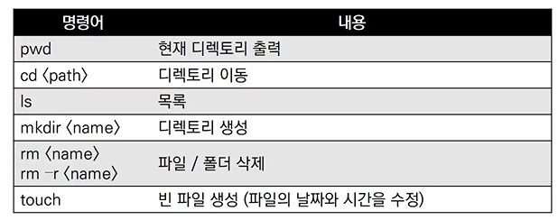
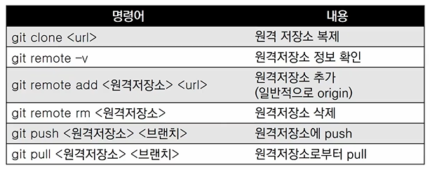
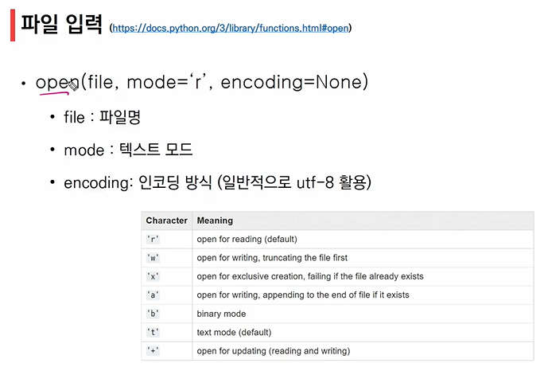
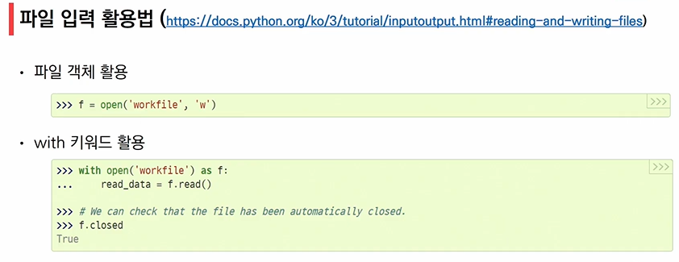
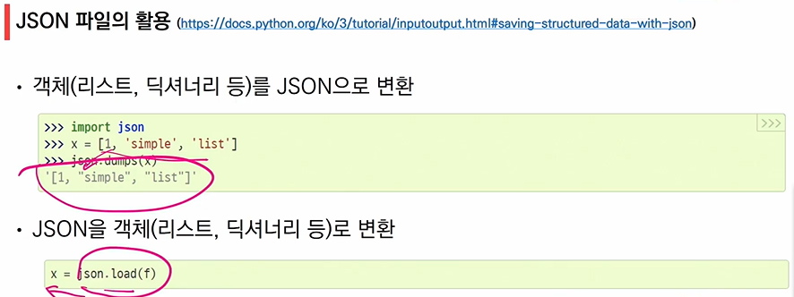
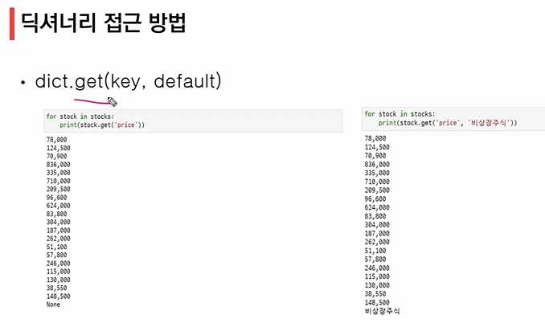

# 2022-01-21

## 1. 관통프로젝트

- 매주 금요일 총 10회 프로젝트
- 한 주간 배운 내용을 바탕으로 명세서 기반의 프로젝트
  - 명세서 구조
    - 목표
    - 준비사항
      - 개발언어 / 프로그램, 라이브러리. 외부 데이터 등
    - 요구사항
      - 제시된 요구사항에 맞춰 개발 진행
    - 결과
      - 반드시 결과로 나타난 폴더 구조

## 2. GIt

- 버전관리
- CVCS vs DVCS
  - 중앙집중식 버전관리시스템 : 중앙에서 버전을 관리하고 파일을 받아서 사용
  - 분산 버전관리시스템 : 원격 저장소를 통하여 협업하고, 모든 히스토리를 클라이언트들이 공유
    - 각자 컴퓨터에서 파일을 만들어서 **버전**을 공유

## 3. Git Bash

- 윈도우에서 Git을 활용하기 위한 기본 도구

- 프롬프트 기본 인터페이스

  - 컴퓨터 정보
  - 디렉토리
  - $

- **Command Line Interface(CLI)** : 명령어 인터페이스 / 명령 줄 인터페이스

  - 가상 터미널 또는 텍스트 터미널을 통해 사용자와 컴퓨터가 상호 작용하는 방식
  - 작업 명령은 사용자가 툴바 키보드 등을 통해 문자열의 형태로 입력
  - 인터페스를 제공하는 프로그램을 명령 줄 해석기 또는 셀
  - cf. GUI : 그래픽 기반의 인터페이스
    - 그래픽으로 사용자와 대화
    - 새폴더가 만들어진 사실을 눈으로 바로 확인할 수 있지만, CLI는 그러지 못함 -> 명령어 ls 로 확인해야 함
  - 

  		- 디렉토리 확인 필수!!

    - ls : list

      mkdir : make directory

      pwd : print work directory

## 4. Git 기초 흐름

- Git 저장소 생성

  - `$ git init`
  - 특정 폴더에 git 저장소(repository)를 만들어 관리
  - master가 됨

- Git 기초 흐름

  1. 작업을 하고
  2. 변경된 파일을 모아 : add
  3. 버전으로 기록한다 : commit

- `git add` : working directory -> staging area

- `git commit` : staging area -> repository

- Working directory : 내가 작업하고 있는 실제 디렉토리

  Staging Area : 버전으로 기록하기 위한 파일 변경 사항의 목록

  Repository : 커밋(버전)들이 기록 되는 곳

- `git staus`

  - git 저장소의 변경된 파일의 상태를 확인하기 위하여 사용

    - 파일의 상태를 알 수 있음

      - changes not staged for commit : 변경사항이 있는데 staging area에 아직 올리지 않은 파일

      - untracked file : commit 된 적이 없는 파일

      - changes ro be committed : staging area에 있는 파일

## 5. 원격 저장소

- 원격 저장소 : 네트워크를 활용한 저장소

- 

  	- `git clone` : 원격저장소에 있던 이름으로 내 컴퓨터에 저장됨

  	- `git remote add` : 원격저장소의 url을 origin이라는 이름으로 저장

- 파일이 아닌 커밋을 push 하거나 pull

- 원격 저장소에서 직접 수정 NO!

- 모든 파일 변경 수정 삭제 생성 -> 로컬에서!

## 6. 파이썬을 활용한 데이터 수집

### 1. 목표

- python 기본 문법 실습
- 타입 입출력에 대한 이해
- 데이터 구조에 대한 분석과 이해
- 데이터를 가공하고 JSON 형태로 저장
  - 알고리즘 / 문제 풀이 : 주로 list, 조건, 반복문 사용
  - 소프트웨어 개발 : 주로 dictionary, list 사용

### 2. 주요 개념

- JSON
  - 문자 기반 데이터 포멧
  - 다수의 프로그래밍 환경에서 쉽게 활용 가능함
  - 기본적인 표현 방식이 딕셔너리와 유사
  - 

- `pprint` : 임의의 파이썬 데이터 구조를 예쁘게 인쇄할 수 있는 기능을 제공
- 리스트 순회
  - 이름만 출력하고 싶다면?
    - 반복문을 사용하며, key로 접근
    - 