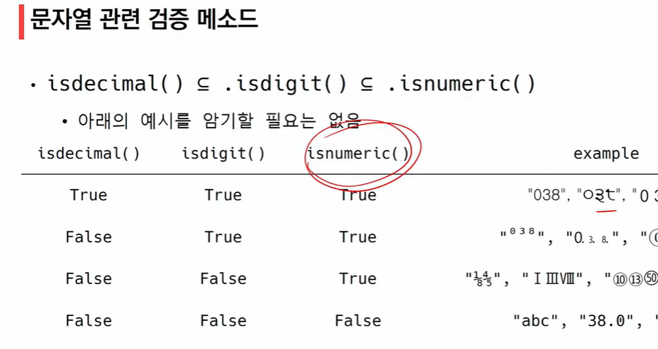

# 2022-01-24

## Method : 함수와 유사 / 입력값과 반환값 유념 (주어, 동사처럼 생각)


## 1. 순서가 있는 데이터 구조

### 1. 문자열

- immutable

- **문자열 조회 / 탐색 및 검증 메소드**

  - 

  - `.find`와 `.index` 구분! -> 문자열 조회 / 탐색

  - `is`가 있으면 boolean 형태로 반환 -> 검증

  - **.find(x)**
    - x의 **첫 번째** 위치를 반환

    - **없으면 -1을 반환함**

    - ```python
      'apple'.find('p')
      => 1
      # 'p'가 들어있는 위치를 모두 알고 싶다면 반복문 사용해야 함
      
      'apple'.find('k')
      => -1
      ```

  - **.index()**
    - x의 **첫 번째** 위치를 반환

    - **없으면 오류 발생**

    - ```python
      'apple'.index('p')
      => 1
      
      'apple'.index('k')
      => Value Error
      ```

  - ```python
     # 문자열 관련 검증 메소드
     'abc'.isalpha() 
     => True
     
     'ㄱㄴㄷ'.isalpha()
     => True
     
     'Ab'.isupper()
     => False
     
     'ab'.islower()
     => True
     
     'Title Title'.istitle() # 단어 간의 공백과 '을 기준으로 맨 앞 글자가 대문자인지
     => True
     ```

  - 

     - 예시를 암기할 필요는 없음
     - `isnumeric()`이 가장 큰 범위 포함

- **문자열 변경 메소드**

  - 

  - **.replace(old, new[,count])**

    - 바꿀 대상 글자를 새로운 글자로 바꿔서 반환

    - count는 선택사항 / 지정하면 해당 개수만큼 진행

    - ```python
      'coone'.replace('0', 'a')
      => 'caane'
      
      'wooooowoo'.replace('o', '!', 2) # 2번만 실행
      =>'w!!ooowoo' 
      ```

  - **.strip([chars])**

    - 특정한 문자들을 지정하면
      - 양쪽을 제거하거나(strip), 왼쪽을 제거하거나(lstrip), 오른쪽을 제거(rstrip)
      
    - 문자열을 지정하지 않으면 공백을 제거함

    - ```python
      '      와우!\n'.strip()
      => '와우!'
      
      '      와우!\n'.lstrip()
      => '와우!\n'
      
      '      와우!\n'.rstrip()
      => '       와우!'
      
      '안녕하세요????'.rstrip('?')
      => '안녕하세요'
      ```

  - **.split(sep=None, maxsplit=-1)**

    - 문자열을 특정한 단위로 나눠 **리스트**로 반환
      - sep (구분자)이 None이거나 지정되지 않으면 연속된 **공백문자**를 단일한 공백문자로 간주하고, 선행 / 후행 공백은 빈 문자열에 포함시키지 않음
        - 공백을 깔끔하게 제거하고 싶을 때
      - maxsplit이 -1인 경우에는 제한이 없음

    - ```python
      'a,b,c'.split('_')
      => ['a,b,c']
      
      'a b c'.split()
      => ['a', 'b', 'c']
      
      'a, b, c'.split(',')
      => ['a', 'b', 'c']
      ```

  - **'seprartor'.join([iterable])**

    - 반복가능한 컨테이너 요소들을 separator(구분자)로 합쳐 문자열 변환
      - iterable에 **문자열**이 아닌 값이 있으면 TypeError 발생

    - 결과를 list에 다 넣어놨을 때 한꺼번에 출력을 하기 위해 사용

    - ```python
      '!'.join('apple')
      => 'a!p!p!l!e!'
      
      ' '.join(['3', '5']) # 합쳐서 사이에 넣는다고 생각
      => '3 5'
      ```

    - ```python
      numbers = ['1', '2', '3']
      # 출력 : 1 2 3
      # 1. 반복문
      for number in numbers:
          print(number, end=' ')
          
      # 2. join(string 메서드)
      print(' '.join(numbers))
      
      # 3. 요소가 문자열이 아닌 경우
      print(' '.join(map(str, numbers)))
      ```

  - 문자열 변경 예시

     - ```python
        msg = 'hI! Everyone, I\'m apple'
        print(msg) => # hI! Everyone, I'm apple
        print(msg.capitalize()) => # Hi! everyone, i'm apple
        print(msg.title()) => # Hi! Everyone, I'M Apple
        print(msg.lower()) => # hi! everyone, i'm apple
        print(msg.upper()) => # HI! EVERYONE, I'M APPLE
        print(msg.swapcase()) => # Hi! eVERYONE, i'M APPLE
        ```


### 2. 리스트

- 리스트 메소드

  - 
  - 리스트의 요소를 변경시키는 것이 가능 => mutable

- **값 추가 및 삭제**

  - **.append(x)**

    - 리스트에 값을 추가함

    - ```python
      cafe = ['starbucks', 'tomntoms', 'hollys']
      print(cafe)
      caffe.append('banapresso')
      print(cafe)
      => ['starbucks', 'tomntoms', 'hollys']
      ['starbucks', 'tomntoms', 'hollys', 'banapresso']
      ```

  - **.extend(iterable)**

    - 리스트에 iterable의 항목을 추가함

    - 문자열이 아니고 리스트의 형태로 추가됨

    - ```python
      cafe = ['starbucks', 'tomntoms', 'hollys']
      cafe.extend['coffee']
      print(cafe)
      => ['starbucks', 'tomntoms', 'hollys', 'coffee']
      
      cafe.extend('coffee')
      print(cafe)
      => ['starbucks', 'tomntoms', 'hollys', 'c', 'o', 'f', 'f', 'e', 'e']
      ```

  - **.insert(i, x)**

    - 정해진 위치 i에 값을 추가함

    - 리스트 길이보다 큰 경우 맨 뒤

    - ```python
      cafe = ['starbucks', 'tomntoms', 'hollys']
      cafe.insert(0, 'start')
      print(cafe)
      => ['start', 'starbucks', 'tomntoms', 'hollys']
      
      cafe = ['starbucks', 'tomntoms', 'hollys']
      cafe.insert(10000, 'end')
      print(cafe)
      => ['starbucks', 'tomntoms', 'hollys', 'end']
      ```

  - **.remove(x)**

    - 리스트에서 값이 x인 것 삭제

    - ```python
      numbers = [1, 2, 3, 'hi']
      numbers.remove('hi')
      print(numbers)
      => [1, 2, 3]
      ```

  - **.pop(i)**

    - 정해진 위치 i에 있는 값을 삭제하고, 그 항목을 반환함

    - i가 지정되지 않으면, 마지막 항목을 삭제하고 반환함

    - ```python
      numbers = ['hi', 1, 2, 3]
      numbers.pop()
      print(numbers)
      => ['hi', 1, 2]
      
      numbers.pop(0)
      print(numbers)
      => [1, 2, 3]
      ```

  - **.clear()**

    - 모든 항목을 삭제함

- **탐색 및 정렬**

  - **.index(x)**

    - x 값을 찾아 해당 **index 값**을 반환
    - 없는 경우 ValueError

  - **.count(x)**

    - 원하는 값의 개수를 반환함

  - **.sort()**

    - 원본 리스트를 정렬함. None 반환

    - **sorted 함수와 비교할 것**

    - ```python
      a = [100, 10, 1, 5]
      
      # 1. 메서드(.sort()) : 원본 리스트를 정렬시키고, None을 리턴
      print(a.sort()) => None
      print(a) => [1, 5, 10, 100]
      
      # 2. 함수(sorted) : 원본 리스트는 변경 없고, 정렬된 리스트를 리턴
      print(sorted(a)) => [1, 5, 10, 100]
      ```

  - **.reverse()**

    - 순서를 반대로 뒤집음 (정렬하는 것이 아님)

    - **원본 자체의 순서를 뒤집는다**

    - ```python
      a = [100, 2, 6]
      a.sort()
      a.reverse()
      print(a)
      => [100, 6, 2]
      ```

      

### 3. 튜플

- 튜플 관련 메소드
  - 튜플은 변경할 수 없기 때문에 값에 영향을 미치지 않는 메소드만을 지원
  - 리스트 메소드 중 항목을 변경하는 메소드들을 제외하고 대부분 동일
- 인덱스로 접근
- 반복결합 연산자
- 확장 연산자 : 값을 병합해서 재할당(같은 자료형)
  - 그러나 extend는 값을 변경하기 때문에 지원하지 않음


## 2. 순서가 없는 데이터 구조

### 1. 셋

- 셋 메소드
  - 
- **추가 및 변경**
  - **.add(elem)**
    - 셋에 값을 추가
    - 순서는 보장 받지 못함
  - **.update(*others)**
    - 여러 값을 추가
  - **.remove(elem)**
    - 셋에서 삭제하고, 없으면 KeyError
  - **.discard(elem)**
    - 셋에서 삭제하고 없어도 에러가 발생하지 않음
  - **.pop()**
    - **임의의** 원소를 제거해 반환
      - 순서가 없기 때문


### 2. 딕셔너리

- 딕셔너리 메소드
  - 
- **조회**
  - **.get(key[,default])**
    - key를 통해 value를 가져옴
    - KeyError가 발생하지 않으며, default 값을 설정할 수 있음 (기본:None)
  - **pop(key[default])**
    - key가 딕셔너리에 있으면 제거하고 해당 값을 반환
    - 그렇지 않으면 default를 반환
    - default값이 없으면 KeyError
    - pop
      - 리스트 : 마지막 원소 제거, index로 접근하여 제거 가능
      - 셋 : 임의의 원소 제거
      - 딕셔너리 : key와 그에 따른 value 제거
- **추가 및 삭제**
  - **.update()**
    - 값을 제공하는 key, value로 덮어씀
    - 키워드 인자 = parameter => 따옴표 안 써!


## 3. 얕은 복사와 깊은 복사

- 복사 방법

  - **할당**

    - 대입 연산자 (=)

      - 리스트 복사 확인하기

      - 대입연산자를 통한 복사는 해당 객체에 대한 객체 참조를 복사

      - 해당 주소의 일부 값을 변경하는 경우 이를 참조하는 모든 변수에 영향

      - ```python
        original_list = [1, 2, 3]
        copy_list = original_list
        print(original_list, copy_list)
        => [1, 2, 3] [1, 2, 3]
        
        copy_list[0] = 'hello'
        print(original_list, copy_list)
        => ['hello', 2, 3] ['hello', 2, 3]
        ```

  - **얕은 복사**

    - ```python
      original_list = [1, 2, 3]
      copy_list = original_list[:] # 슬라이싱
      copy_lsit = list(original_list) # 형변환
      print(original_list, copy_list)
      => [1, 2, 3] [1, 2, 3]
      
      copy_list[0] = 'hello'
      print(original_list, copy_list)
      => [1, 2, 3] ['hello', 2, 3]
      ```

    - Slice 연산자 활용하여 같은 원소를 가진 리스트지만 연산된 결과를 복사 (다른 주소)

    - **주의사항**

      - 복사하는 리스트의 원소가 주소를 참조하는 경우

        - 2차원 리스트의 경우 => 깊은 복사 해야 함!

      - ```python
        a = [1, 2, ['a', 'b']]
        b = a[:]
        b[2][0] = 0
        print(a, b)
        => [1, 2, [0, 'b']] [1, 2, [0, 'b']]
        ```

  - **깊은 복사**

    - 리스트 복사 확인하기

    - ```python
      import copy
      a = [1, 2, ['a', 'b']]
      b = copy.deepcopy(a)
      b[2][0] = 0
      print(a, b)
      => [1, 2, ['a', 'b']] [1, 2, [0, 'b']]
      ```


## 4. Error  / 예외 처리

### 1. 디버깅

- 조건문 : 내가 작성한 조건문이 모든 조건을 커버하는지 => **branches**
- 반복문 : 원하는 횟수만큼 반복하는지 / 값 변경 및 결과 (진입 및 결과) => **for loops**
- while문 : for loops + 종료 조건을 잘 설정하였는지 => **while loops**
- 함수의 호출 / parameter을 제대로 넣었는지 / 결과가 잘 나오는지 / type => **function & method**

- print 함수 활용
  - 특정 함수 결과, 반복/조건 결과 등 나눠서 생각, 코드를 bisection으로 나눠서 생각
- 개발 환경(text editor, IDE) 등에서 제공하는 기능 활용
  - breakpoint, 변수 조회 등
- Python tutor 활용 (단순 파이썬 코드인 경우)
- 뇌컴파일, 눈디버깅
- 에러 메시지가 발생하는 경우
  - 해당하는 위치를 찾아 메시지를 해결
- 로직 에러가 발생하는 경우
  - 명시적인 에러 메시지 없이 예상과 다른 결과가 나온 경우
    - 정상적으로 동작하였던 코드 이후 작성된 코드를 생각해봄
    - 전체 코드를 살펴봄


### 2. 에러와 예외

- **문법 에러**

  - SyntaxError가 발생하면, 파이썬 프로그램은 실행이 되지 않음
  - 파일 이름, 줄 번호, ^ 문자를 통해 파이썬이 코드를 읽어 나갈 때 문제가 발생한 위치를 표현
  - 줄에서 에러가 감지된 가장 앞의 위치를 가리키는 캐럿 기호(^)를 표시
  - Invalid Syntax
  - assign to literal
  - EOL (End of Line)
  - EOF (End of File)

- **예외**

  - 실행 도중 예상치 못한 상황을 맞이하면, 프로그램 실행을 멈춤
    - 문장이나 표현식이 문법적으로 올바르더라도 발생하는 에러
  - 실행 중에 감지되는 에러들을 예외라고 부름
  - 예외는 여러 타입으로 나타나고, 타입이 메시지의 일부로 출력됨
    - NameError, TypeError 등은 발생한 예외 타입의 종류(이름)
  - 모든 내장 예외는 Exception Class를 상속받아 이뤄짐
  - 사용자 정의 예외를 만들어 관리할 수 있음
  - ZeroDivisionError : 0으로 나누고자 할 때 발생
  - NameError : namespace 상에 이름이 없는 경우
  - TypeError 
    - 타입 불일치
    - argument 누락
    - argument 개수 초과
    - argument type 불일치
  - ValueError : 타입은 올바르나 값이 적절하지 않거나 없는 경우
  - IndexError : 인덱스가 존재하지 않거나 범위를 벗어나는 경우
  - KeyError : 해당 키가 존재하지 않는 경우
  - ModuleNotFoundError : 존재하지 않는 모듈을 import하는 경우
  - ImportError : Module은 있으나 존재하지 않는 클래스 / 함수를 가져오는 경우
  - KeyboardInterrupt : 임의로 프로그램을 종료하였을 때
  - IndentationError : Indentation이 적절하지 않은 경우

- **파이썬 내장 예외**

  - 

    

### 3. 예외 처리

- **예외 처리**

  - try문 / exept절을 이용하여 예외 처리 가능
  - **try문**
    - 오류가 발생할 가능성이 있는 코드를 실행
    - 예외가 발생되지 않으면, exept 없이 실행 종료
  - **except문**
    - 예외가 발생하면, except 절이 실행
    - 예외 상황을 처리하는 코드를 받아서 적절한 조치를 취함

- **처리 순서**

  - 

- **예외 처리 예시**

  - ```python
    try:
        num = input('숫자 입력 : ')
        print(int(num))
    except ValueError:
        print('숫자가 입력되지 않았습니다.')
    ```

- **에러 메시치 처리 (as)**

  - as 키워드를 활용하여 원본 에러 메시지를 사용할 수 있음

    - 예외를 다른 이름에 대입

  - ```python
    try:
        num = input('숫자 입력 : ')
        print(int(num))
    except ValueError as e:
        print(f'{e}, 숫자가 입력되지 않았습니다.')
    ```

- 순차적으로 수행되므로, 가장 작은 범주부터 예외처리를 해야 함

- **예외 처리 종합**

  - try : 코드를 실행함
  - except : try문에서 예외가 발생 시 실행함
  - else : try문에서 예외가 발생하지 않으면 실행함
  - finally : 예외 발생 여부와 관계 없이 항상 실행함


### 4. 예외 발생 시키기

- `raise` statement
  - `raise`를 통해 예외를 강제로 발생
  - `raise <표현식> (메시지)`
- `assert` statement
  - 일반적으로 디버깅 용도로 사용
  - `assert <표현식>, <메시지>`
  - 표현식이 False인 경우 발생시킴
- raise vs assert
  - raise : 실제 프로덕션 코드에서 활용
  - assert : 특정 조건이 거짓이면 발생. 디버깅 및 테스트에서 활용
  - 
