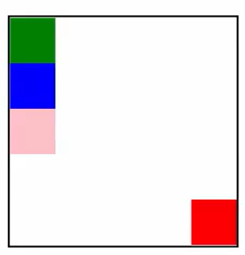
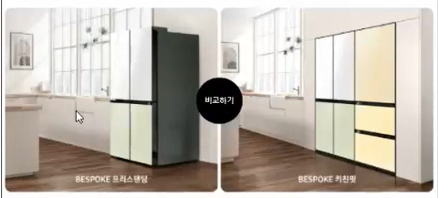

# 2022-02-04-2


## 실습 1

- 

```css
#green {
    background-color: green;
    position: relative;
    left: 200px;
    top: 200px;
}
이렇게 하면 초록색 박스가 가운데로 가고, 파란색 박스는 제자리

#green {
    background-color: green;
    position: absolute;
    left: 200px;
    top: 200px;
}
이렇게 하면 초록색 박스가 가운데로 가고, 파란색 박스는 왼쪽 위로 올라감
```

- 어떤 요소를 기준으로 absolute를 적용시키고 싶으면 그 친구는 static이면 안됨! (relative로 설정을 해야 absolute 요소가 움직이는 기준이 될 수 있음)


## 실습 2

- 가운데 정렬 : margin 0 auto

- background 색은 padding까지 들어감

- img는 인라인 요소지만 width, height등의 속성을 지정할 수 있음

- 지정한 영역 안에 이미지를 꽉 채우고 싶은데 사진 고유의 비율 때문에 꽉 채워지지 않는다면 `width: 100% ` 주면 됨 (가로로 사진 꽉 채우기)

- line height : 수직 가운데 정렬 (텍스트가 들어있는 박스의 height와 같게 줘야 함)

- 인라인요소는 baseline을 기준으로 살짝 밑까지 영역을 차지하고 있음 (p, q 같은 애들 때문)
  - 이미지는 인라인요소기 때문에 이미지 밑에 박스를 만들어도 사이에 살짝의 공간이 있음
    - 없애주고 싶으면 이미지를 블럭 요소로 바꿔준다!
      - `display: block;`
    - 아니면 이미지가 있는 영역에서 `font-size: 0;`
    - 아니면 이미지가 있는 영역에서 `line-height: 0;`

- 스타일의 기본 : **마크업**

  - 선택자로 지정한 후 스타일링해야 함

  - ```html
    <p>
        <span style="color: red;">성산일출봉</span>은 제주도의...
    </p>
    
    이렇게 하면 문단에서 "성산일출봉"만 스타일링 가능
    ```


## 실습 3

- 너비와 높이를 지정하고 싶다면 인라인 요소는 블럭 요소로 바꿔줘야 함

- 인라인 요소 가운데 정렬

  - `text-align: center;` 글씨 수평 가운데 정렬

    `line-height: 50px;` 글씨 수직 가운데 정렬

- a 태그의 기본 속성 제거

  - a 태그는 default로 밑줄이 생김 (`text-decoration: underline;` 으로 설정되어 있음)
    - 없애주려면 `text-decoration: none;`

- 블럭을 동그랗게 표현하기

  - `border-radius: 50%;`

- absolute 쓸거면 부모 요소 무조건 relative 지정해주기!

- 

  - 사진의 가운데에 위치시키고 싶을 때

    - ```css
      .compare-button {
          position: absolute;
          top: 50%;
          left: 50%;
      }
      이렇게 하면 '비교하기' 네모박스의 왼쪽 위 포인트가 중앙에 가게 됨
      
      .compare-button {
          position: absolute;
          top: 50%;
          left: 50%;
          margin-top: -50px;
          margin-left: -50px;
      }
      이렇게 하거나
      
      .compare-button {
          position: absolute;
          top: 50%;
          left: 50%;
          transform: translate(-50%, -50%); 
          /*translate 안에는 % 또는 픽셀로 나타냄*/
      }
      이렇게 해주면 됨 (해당 너비, 높이의 절반만큼 위치 이동)
      ```


## Emmet

- ```html
  ul>li*3
  
  <ul>
      <li></li>
      <li></li>
      <li></li>
  </ul>
  
  ul#fruit-list>li.fruit-item*3
  
  <ul id="fruit-list">
      <li class="fruit-item"></li>
      <li class="fruit-item"></li>
      <li class="fruit-item"></li>
  </ul>
  ```

