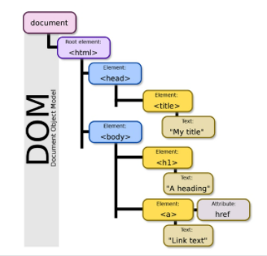
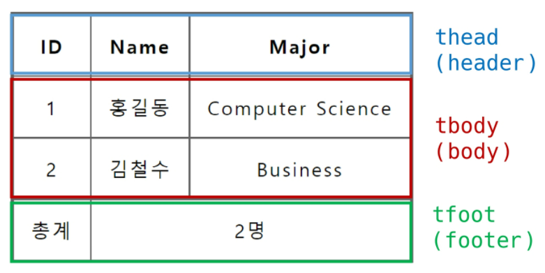
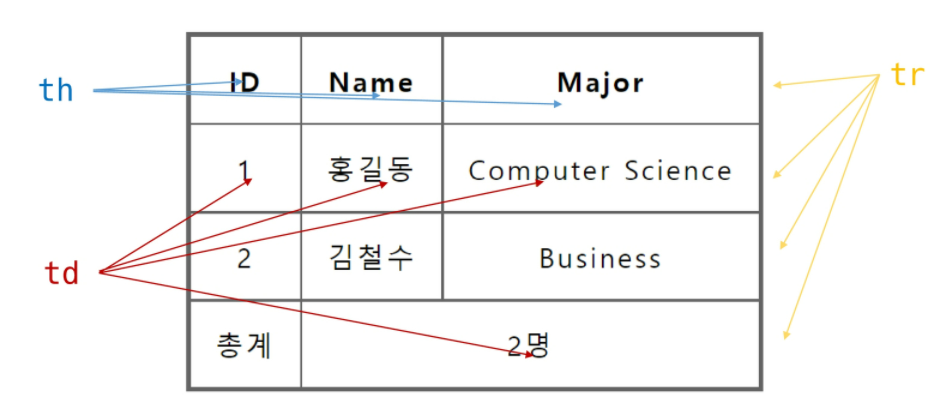
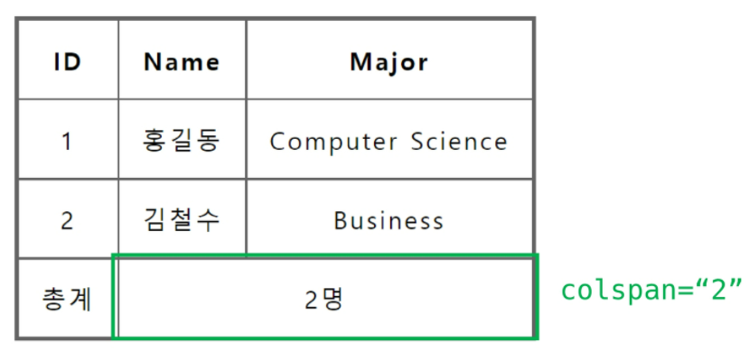
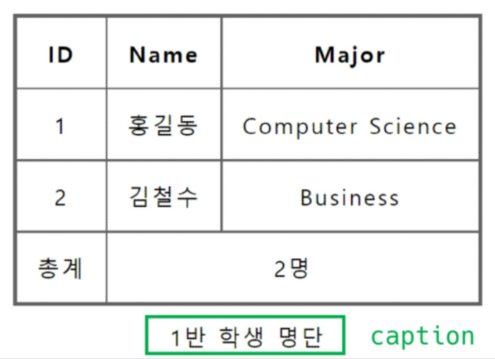
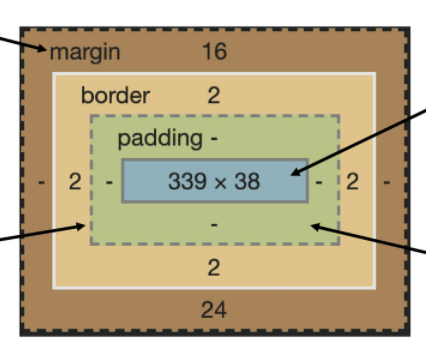
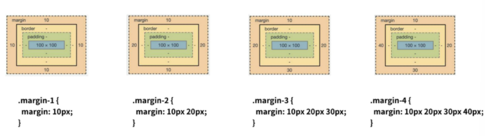

# 2022-02-04

# HTML & CSS

- 현재의 웹 표준 : WHATWG

# 1. HTML

- **Hyper Text Markup Language**
  - Hyper Text : 참조(하이퍼링크)를 통해 사용자가 한 문서에서 다른 문서로 즉시 접근할 수 있는 텍스트
  - Markup Language : 태그 등을 이용하여 문서나 데이터의 구조를 명시하는 언어
- 웹 페이지를 작성(구조화)하기 위한 언어


## 1. HTML 기본 구조

### 1. HTML 기본 구조

- ```html
  <!DOCTYPE html>
  <html lang="ko">
  <head>
      <meta charset="UTF-8">
      <title>Document</title>
  </head>
  <body>
      
  </body>
  </html>
  ```

- **html** : 문서의 최상위 요소

- **head** : 문서 메타데이터 요소

  - 문서 제목, 인코딩, 스타일, 외부 파일 로딩 등

  - 일반적으로 브라우저에 나타나지 않는 내용

  - ```html
    <title> : 브라우저 상단 타이틀 </title>
    <meta> : 문서 레벨 메타데이터 요소
    <link> : 외부 리소스 연결 요소 (CSS파일, favicon 등)
    <script> : 스크립트 요소 (Javascript 파일/코드) </script>
    <style> : CSS 직접 작성 </style>
    ```

  - Open Graph Protocol : 메타데이터를 표현하는 새로운 규약
    - HTML 문서의 메타데이터를 통해 문서의 정보를 전달
    - 메타정보에 해당하는 제목, 설명 등을 쓸 수 있도록 정의

- **body** : 문서 본문 요소

  - 실제 화면 구성과 관련된 내용


### 2. DOM(Document Object Model) 트리

- 텍스트 파일인 HTML 문서를 브라우저에서 렌더링하기 위한 구조
  - HTML 문서에 대한 모델을 구성함
  - HTML 문서 내의 각 요소에 접근 / 수정에 필요한 프로퍼티와 메서드 제공
- 


### 3. 요소

- HTML의 요소는 **태그**와 **내용**으로 구성되어 있다.

  - 태그는 컨텐츠(내용)를 감싸는 것으로 그 정보의 성격과 의미를 정의

- ```html
  <h1>contents</h1>
  <여는태그>내용</닫는태그>
  ```

- **내용이 없는 태그들**

  - ```html
    br, hr, img, input, link, meta
    ```

- 요소는 중첩될 수 있음

  - 요소의 중첩을 통해 하나의 문서를 구조화
  - 여는 태그와 닫는 태그의 쌍을 잘 확인해야함
    - 오류를 반환하는 것이 아니니 그냥 레이아웃이 깨진 상태로 출력
    - 디버깅이 힘들어질 수 있음


### 4. 속성

- 태그별로 사용할 수 있는 속성은 다르다.

- ```html
  <a href="https://google.com"></a>
    속성명      속성값
  ```

- 속성 작성 방식 통일하기

  - 공백은 No! 
  - 쌍따옴표 사용

- 속성을 통해 태그의 부가적인 정보를 설정할 수 있음

- 요소는 속성을 가질 수 있으며, 경로나 크기와 같은 추가적인 정보를 제공

- 요소의 **시작 태그에 작성**하며 보통 이름과 값이 하나의 쌍으로 존재

- 태그에 상관없이 사용가능한 속성(HTML Global Attribute)들도 있음

  - **HTML Global Attribute**

    - 모든 HTML 요소가 공통으로 사용할 수 있는 대표적인 속성

      - ```html
        id : 문서 전체에서 유일한 고유 식별자 지정
        class : 공백으로 구분된 해당 요소의 클래스의 목록 (CSS, JS에서 요소를 선택하거나 접근)
        data-* : 페이지에 개인 사용자 정의 데이터를 저장하기 위해 사용
        style : inline 스타일
        title : 요소에 대한 추가 정보 지정
        tabindex : 요소의 탭 순서
        ```


### 5. 시맨틱 태그

- **의미론적 요소**를 담은 태그

  - 기존 영역을 의미하는 div 태그를 대체하여 사용

- ```html
  header : 문서 전체나 섹션의 헤더 (머리말 부분)
  nav : 내비게이션
  aside : 사이드에 위치한 공간, 메인 콘텐츠와 관련성이 적은 콘텐츠
  section : 문서의 일반적인 구분, 컨텐츠의 그룹을 표현
  article : 문서, 페이지, 사이트 안에서 독립적으로 구분되는 영역
  footer : 문서 전체나 섹션의 푸터 (마지막 부분)
  ```

- Non semantic 요소는 div, span 등이 있으며 h1, table 태그들도 시맨틱 태그로 볼 수 있음

- 개발자 및 사용자 뿐만 아니라 검색엔진 등에 의미 있는 정보의 그룹을 태그로 표현

- 단순히 구역을 나누는 것 뿐만 아니라 '의미'를 가지는 태그들을 활용하기 위한 노력

- 요소의 의미가 명확해지기 때문에 **코드의 가독성**을 높이고 **유지보수**를 쉽게 함

- 검색엔진최적화(SEO)를 위해서 메타태그, 시맨틱 태그 등을 통한 마크업을 효과적으로 활용해야 함


## 2. HTML 문서 구조화

### 1. 텍스트 요소

```html
<a> href 속성을 활용하여 다른 URL로 연결하는 하이퍼링크 생성 </a>
<b> 굵은 글씨 요소 </b>
<strong> 중요한 강조하고자 하는 요소 (보통 굵은 글씨로 표현) </strong>
<i> 기울임 글씨 요소 </i>
<em> 중요한 강조하고자 하는 요소 (보통 기울임 글씨로 표현) </em>
<br> 텍스트 내에 줄바꿈 생성
 src 속성을 활용하여 이미지 표현
<span> 의미없는 인라인 컨테이너 </span>
```


### 2. 그룹 컨텐츠

```html
<p>
    하나의 문단
</p>
<hr> 문단 레벨 요소에서의 주제의 분리를 의미하며 수평선으로 표현됨
<ol>
    순서가 있는 리스트
</ol>
<ul>
    순서가 없는 리스트
</ul>
<pre> HTML에 작성한 내용을 그대로 표현. 보통 고정폭 글꼴이 사용되고 공백문자를 유지 </pre>
<blockquote>
    텍스트가 긴 인용문. 주로 들여쓰기를 한 것으로 표현됨
</blockquote>
<div>
    의미 없는 블록 레벨 컨테이너
</div>
```


### 3. table

- table의 각 영역을 명시하기 위해 <thead> <tbody> <tfoot> 요소를 활용
  - 
- <tr>으로 가로줄을 구성하고 내부에는 <th> 혹은 <td>로 셀을 구성
  - 
- colspan, rowspan 속성을 활용하여 셀 병합
  - colspan : 세로를 병합하여 가로가 길어짐 (세로줄 없애기)
    - 
  - rowspan : 가로를 병합하여 세로가 길어짐 (가로줄 없애기)
- <caption> 을 통해 표 설명 또는 제목을 나타냄
  - 
- table 태그 기본 구성
  - thead
    - tr > th
  - tbody
    - tr > td
  - tfoot
    - tr > td
  - caption


### 4. form

- 정보 (데이터)를 서버에 제출하기 위한 영역

- 기본 속성

  - ```html
    action : form을 처리할 서버의 URL
    method : form을 제출할 때 사용한 HTTP 메서드 (GET 혹은 POST)
    enctype : method가 post인 경우 데이터의 유형
    	application/x-www-form-urlencoded : 기본값
    	multipart/form-data : 파일 전송시 (input type이 file인 경우)
    ```

- ```html
  <form action="/search" method="GET">
      
  </form>
  ```


### 5. input

- 다양한 타입을 가지는 입력 데이터 유형과 위젯이 제공됨

- 기본 속성

  - ```html
    name : form control에 적용되는 이름 (이름/값 페어로 전송됨)
    value : form control에 적용되는 값 (이름/값 페어로 전송됨)
    required, readonly, autofocus, autocomplete, disabled 등
    ```

- ```html
  <form action="/search" method="GET">
      <input type="text" name="q">
  </form>
  ```

- label을 클릭하여 input 자체의 초점을 맞추거나 활성화 가능

  - 사용자는 선택할 수 있는 영역이 늘어나 웹/모바일 환경에서 편하게 사용 가능

- <input>에 **id** 속성을, <label>에는 **for** 속성을 활용하여 상호 연관을 시킴

  - ```html
    <label for="agreement">개인정보 수집에 동의합니다.</label>
    <input type="checkbox" name="agreement" id="agreement">
    ```

- 유형

  - 일반적으로 입력을 받기 위하여 제공되며 타입 별로 HTML 기본 검증 혹은 추가 속성을 활용할 수 있음

    - ```html
      text : 일반 텍스트 입력
      password : 입력 시 값이 보이지 않고 문자를 특수 기호(*)로 표현
      email : 이메일 형식이 아닌 경우 form 제출 불가
      number : min, max, step 속성을 활용하여 숫자 범위 설정 가능
      file : accept 속성을 활용하여 파일 타입 지정 가능
      ```

  - 일반적으로 label을 사용하여 내용을 작성하여 항목 중 선택할 수 있는 input을 제공

    - 동일 항목에 대해서는 name을 지정하고 선택된 항목에 대한 value를 지정해야 함
      - checkbox : 다중 선택
      - radio : 단일 선택

  - 다양한 종류의 input을 위한 picker를 제공

    - color : color picker
    - date : date picker

  - hidden input을 활용하여 사용자 입력을 받지 않고 서버에 전송되어야 하는 값을 설정

    - hidden : 사용자에게 보이지 않는 input

---

# 2. CSS

- Cascading Style Sheets

- 스타일을 지정하기 위한 언어

- CSS 구문

  - ```css
    h1{
        color: blue;
        font-size: 15px;
    }
    
    선택자{
        선언;
        속성: 값;
    }
    ```

  - 선택자를 통해 스타일을 지정할 HTML 요소를 선택

  - 중괄호 안에는 속성과 값, 하나의 쌍으로 이루어진 선언을 진행

  - 각 쌍은 선택한 요소의 속성, 속성에 부여할 값을 의미

    - 속성 : 어떤 스타일 기능을 변경할지 결정
    - 값 : 어떻게 스타일 기능을 변경할지 결정

- CSS 정의 방법

  - 인라인 : 해당 태그에 직접 <style> 속성을 활용
  - 내부 참조 : <head> 태그 내에 <style>에 지정
  - 외부 참조 : 외부 CSS 파일을 <head> 내 <link>를 통해 불러오기


## 1. CSS Selectors

### 1. 선택자 유형

- 기본 선택자
  - 전체 선택자, 요소 선택자
  - 클래스 선택자, 아이디 선택자, 속성 선택자
- 결합자
  - 자손 결합자, 자식 결합자
  - 일반 형제 결합자, 인접 형제 결합자
- 의사 클래스 / 요소
  - 링크, 동적 의사 클래스
  - 구조적 의사 클래스, 기타 의사 클래스, 의사 엘리먼트, 속성 선택자


### 2. 선택자 정리

- 요소 선택자
  - HTML 태그를 직접 선택
- 클래스 선택자
  - '.' 문자로 시작하며, 해당 클래스가 적용된 항목을 선택
- 아이디 선택자
  - '#' 문자로 시작하며, 해당 클래스가 적용된 항목을 선택
  - 일반적으로 하나의 문서에 1번만 사용
    - 여러 번 사용해도 동작하지만, 단일 id를 사용하는 것을 권장


### 3. CSS 적용 우선순위

1. 중요도 - 사용시 주의

   !important

2. 우선순위

   인라인 > id > class, 속성, pseudo-class > 요소, pseudo-element

3. CSS 파일 로딩 순서


### 4. CSS 상속

- 부모 요소의 속성을 자식에게 상속
  - 속성 중에는 상속이 되는 것과 되지 않는 것들이 있다.
  - 상속되는 것 예시
    - text 관련 요소(font, color, text-align), opacity, visibilty 등
  - 상속되지 않는 것 예시
    - box model 관련 요소(width, height, margin, padding, border, box-sizing, display)
    - position 관련 요소(position, top/right/bottom/left, z-index)


## 2. CSS 단위

### 1. 크기 단위

- px (픽셀)
  - 모니터 해상도의 한 화소인 '픽셀' 기준
  - 픽셀의 크기는 변하지 않기 때문에 고정적인 단위
- %
  - 백분율 단위
  - 가변적인 레이아웃에서 자주 사용
- em
  - (바로 위, 부모 요소에 대한) 상속의 영향을 받음
  - 배수 단위, 요소에 지정된 사이즈에 상대적인 사이즈를 가짐
- rem
  - (바로 위, 부모 요소에 대한) 상속의 영향을 받지 않음
  - 최상위 요소(html)의 사이즈를 기준으로 배수 단위를 가짐
- viewport
  - 웹 페이지를 방문한 유저에게 바로 보이게 되는 웹 컨텐츠의 영역 (디바이스 화면)
  - 디바이스의 viewport를 기준으로 상대적인 사이즈가 결정됨


### 2. 색상 단위

- 색상 키워드
  - 대소문자를 구분하지 않음
  - red, blue, black과 같은 특정 색을 직접 글자로 나타냄
- RGB 색상
  - 16진수 표기법 혹은 함수형 표기법을 사용해서 특정 색을 표현하는 방식
- HSL 색상
  - 색상, 채도, 명도를 통해 특정 색을 표현하는 방식
- a는 alpha (투명도)


## 3. Selectors 심화

### 1. 결합자

- 자손 결합자 (div span)
  - selector A 하위의 모든 selector B 요소
- 자식 결합자 (div > span)
  - selector A 바로 아래의 selector B 요소
- 일반 형제 결합자 (p ~ span)
  - selector A의 형제 요소 중 뒤에 위치하는 selector B 요소를 모두 선택
- 인접 형제 결합자 (p + span)
  - selector A의 형제 요소 중 바로 뒤에 위치하는 selector B 요소를 선택


## 4. Box model

### 1. CSS 원칙

- 모든 요소는 네모(박스모델)이고, 위에서부터 아래로, 왼쪽에서 오른쪽으로 쌓인다.
- **좌측 상단에 배치**


### 2. Box model

- 모든 HTML 요소는 box 형태로 되어있음
- 하나의 박스는 네 부분으로 이루어짐
  - **content** : 글이나 이미지 등 요소의 실제 내용
  - **padding** : 테두리 안쪽의 내부 여백 / 요소에 적용된 배경색, 이미지는 padding까지 적용
  - **border** : 테두리 영역
  - **margin** : 테두리 바깥의 외부 여백 / 배경색을 지정할 수 없다
  - 
- 

- box-sizing
  - 기본적으로 모든 요소의 box-sizing은 content-box
    - padding을 제외한 순수 contents 영역만을 box로 지정
  - 다만, 우리가 일반적으로 영역을 볼 때는 border까지의 너비를 100px 보는 것을 원함
    - 그 경우 box-sizing을 border-box으로 설정


## 5. Display

### 1. CSS 원칙

- 모든 요소는 네모(박스모델)이고, 좌측 상단에 배치
- display에 따라 크기와 배치가 달라진다.


### 2. 대표적으로 활용되는 display

- **block**
  - 줄 바꿈이 일어나는 요소
  - 화면 크기 전체의 가로 폭을 차지한다.
  - 블록 레벨 요소 안에 인라인 레벨 요소가 들어갈 수 있음
  - div / ul, ol , li / p / hr / form 등
  - 너비를 가질 수 없다면 자동으로 부여되는 margin
- **inline**
  - 줄 바꿈이 일어나지 않는 행의 일부 요소
  - content 너비만큼 가로 폭을 차지한다.
  - width, height, margin-top, margin-bottom을 지정할 수 없다.
  - 상하 여백은 line-height로 지정한다.
  - span / a / img / input, label / b, em, i, strong 등
  - inline의 기본 너비는 컨텐츠 영역 만큼
- **inline-block**
  - block과 inline 레벨 요소의 특징을 모두 가짐
  - inline처럼 한 줄에 표시 가능하고, block처럼 width, height, margin 속성을 모두 지정할 수 있음
- **none**
  - 해당 요소를 화면에 표시하지 않고, 공간조차 부여되지 않음
  - 이와 비슷한 visibility : hidden은 해당 요소가 공간은 차지하나 화면에 표시만 하지 않는다.


## 6. Position

### 1. CSS position

- 문서 상에서 요소 위치를 지정
- **static** : 모든 태그의 기본 값 (기준 위치)
  - 일반적인 요소의 배치 순서에 따름 (좌측 상단)
  - 부모 요소 내에서 배치될 때는 부모 요소의 위치를 기준으로 배치 됨
- 아래는 좌표 프로퍼티(top, bottom, left, right)를 사용하여 이동 가능
  - **relative** : 상대 위치
    - **자기 자신의 static 위치**를 기준으로 이동 (normal flow 위치)
    - 레이아웃에서 요소가 차지하는 공간은 static일 때와 같음 (normal position 대비 offset)
  - **absolute** : 절대 위치
    - 요소를 일반적인 문서 흐름에서 제거 후 레이아웃에 공간을 차지하지 않음 (normal flow에서 벗어남)
    - static이 아닌 **가장 가까이 있는 부모/조상 요소를 기준으로 이동 (없는 경우 body)**
    - 특정 영역 위에 존재해야할 때
  - **fixed** : 고정 위치
    - 요소를 일반적인 문서 흐름에서 제거 후 레이아웃에 공간을 차지하지 않음 (normal flow에서 벗어남)
    - 부모 요소와 관계없이 viewport를 기준으로 이동
      - 스크롤 시에도 항상 같은 곳에 위치함
