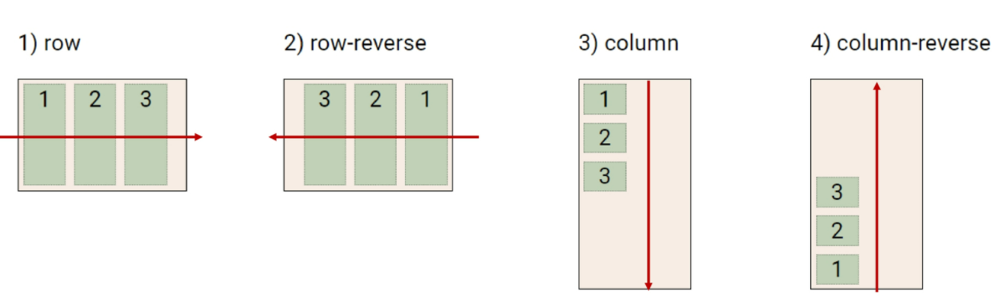
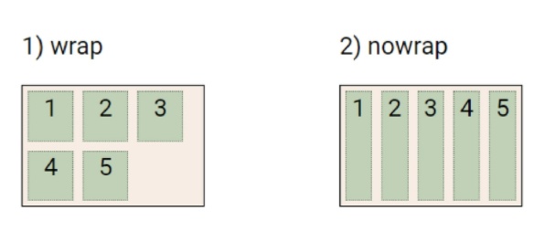
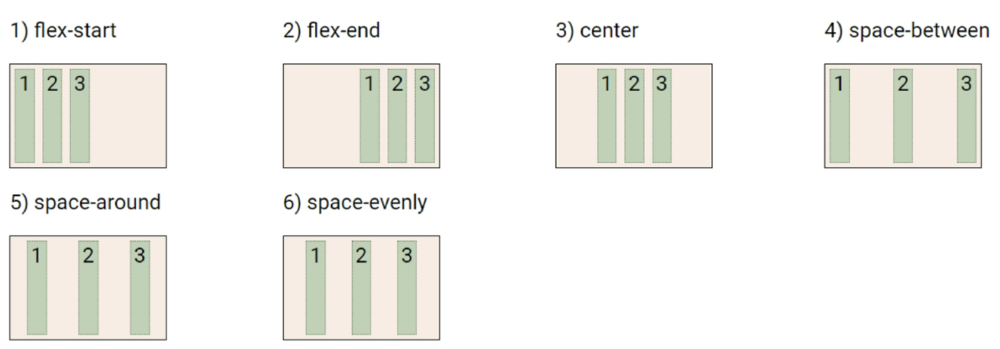
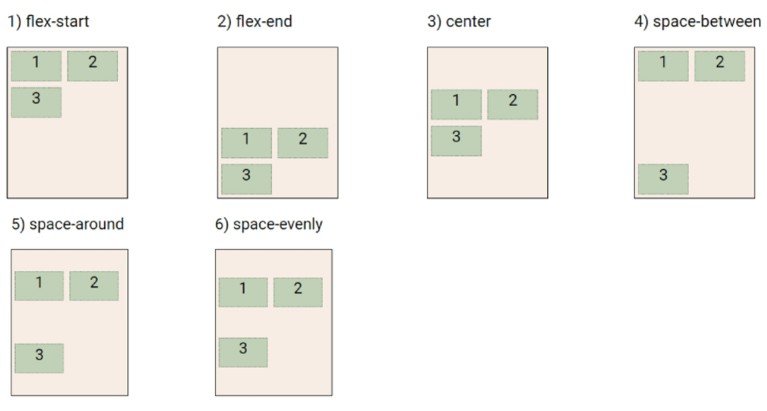
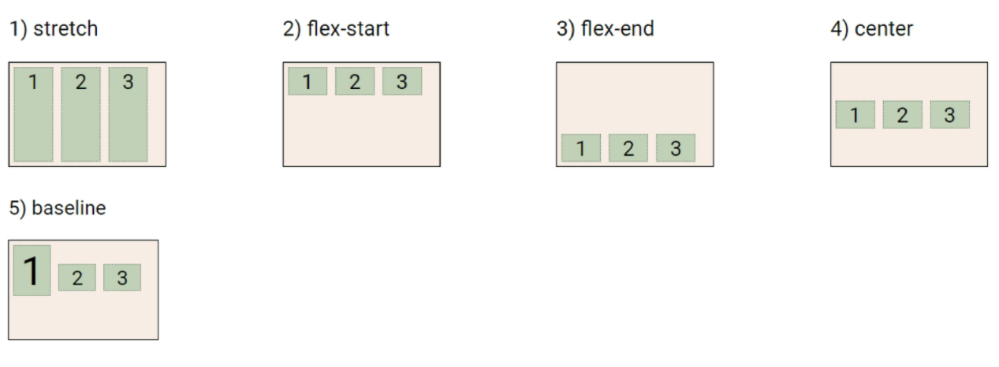
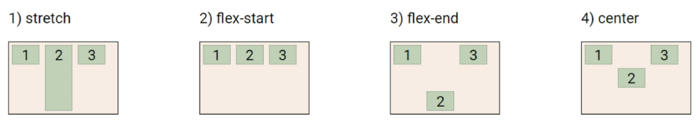
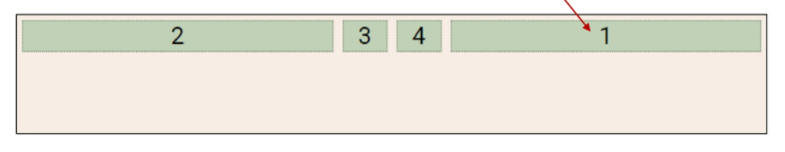

# 2022-02-07

# 1. Flexbox

## 1. CSS Flexible Box Layout

- 행과 열 형태로 아이템들을 배치하는 1차원 레이아웃 모델
  - 내부 영역 안에서의 배치
- **축**
  - main axis (메인 축) 
    - `flex-direction : row` => 메인 축이 가로, 교차 축이 세로
    - `flex-direction : column` => 메인 축이 세로, 교차 축이 가로
  - cross axis (교차 축)
- **구성 요소**
  - **Flex Container (부모 요소)**
    - flexbox 레이아웃을 형성하는 가장 기본적인 모델
    - flex item들이 놓여있는 영역
    - display 속성을 flex 혹은 inline-flex로 지정
      - `display: flex;`
  - **Flex Item (자식 요소)**
    - 컨테이너에 속해 있는 컨텐츠 (박스)
- **수직 정렬**
- **아이템의 너비와 높이 혹은 간격을 동일하게 배치**


## 2. Flex 속성

1. **배치 설정**

   - **`flex-direction`** 

     - main axis 기준 방향 설정

     - 역방향의 경우 HTML 태그 선언 순서와 시각적으로 다르니 유의 (웹 접근성에 영향)

     - ```css
       row
       row-reverse /*마크업 자체는 1-2-3 순서*/
       column
       coulmn-reverse
       ```

     - 

     - **`flex-wrap`**

       - 요소들이 강제로 한 줄에 배치되게 할 것인지 여부 설정

       - 아이템이 컨테이너를 벗어나는 경우 해당 영역 내에 배치되도록 설정

       - 즉, 기본적으로 컨테이너 영역을 벗어나지 않도록 함

       - ```css
         wrap /*넘치면 그 다음 줄로 배치*/
         nowrap /*(기본값) 한 줄에 배치*/
         ```

       - 

   - **`flex-flow`**
     - `flex-direction`과 `flex-wrap`의 shorthand
     - `flex-direction`과 `flex-wrap`에 대한 설정 값을 차례로 작성
       - `flex-flow: row nowrap;`

2. **공간 나누기**

   - **`justify-content`** (main axis)

     - main axis를 기준으로 공간 배분

     - ```css
       flex-start /*기본값, 아이템들을 axis 시작점으로*/
       flex-end /*아이템들을 axis 끝 쪽으로*/
       center /*아이템들을 axis 중앙으로*/
       space-between /*아이템 사이의 간격을 균일하게 분배*/
       space-around /*아이템을 둘러싼 영역을 균일하게 분배 (가질 수 있는 영역을 반으로 나눠서 양쪽에)*/
       space-evenly /*전체 영역에서 아이템 간 간격을 균일하게 분배*/
       ```

     - 

   - **`align-content`** (cross axis) 

     - cross axis를 기준으로 공간 배분

       - 아이템이 한 줄로 배치되는 경우 확인할 수 없음 (여러 줄!)

     - ```css
       flex-start
       flex-end
       center
       space-between
       space-around
       space-evenly
       ```

     - 

3. **정렬**

   - **`align-items`** 

     - **모든 아이템**을 cross axis 기준으로 정렬

       - 아이템이 한 줄로 배치되는 경우

     - ```css
       stretch /*기본값, 컨테이너를 가득 채움*/
       flex-start
       flex-end
       center
       baseline /*텍스트 baseline에 기준선을 맞춤*/
       ```

     - 

   - **`align-self`**

     - **개별 아이템**을 cross axis 기준으로 정렬

     - ```css
       stretch
       flex-start
       flex-end
       center
       ```

     - 

 4. 기타

    - `flex-grow` : 남은 영역을 아이템에 분배

    - `order` : 배치 순서

    - ```html
      <div class="flex_item grow-1 order-3">1</div>
      <div class="flex_item grow-1">2</div>
      <div class="flex_item order-1">1</div>
      <div class="flex_item order-2">1</div>
      ```

    - 

# 2. Grid

# 3. Bootstrap

# 4. Responsive Web


