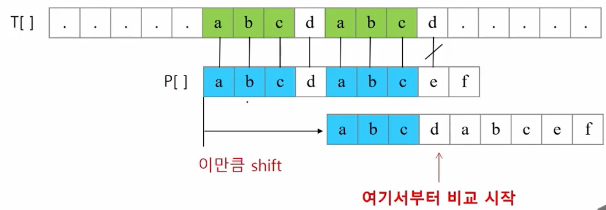
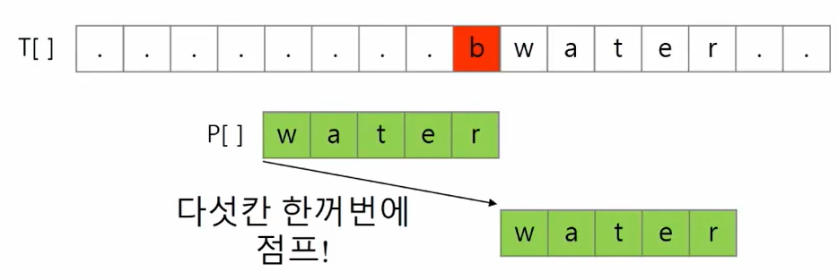
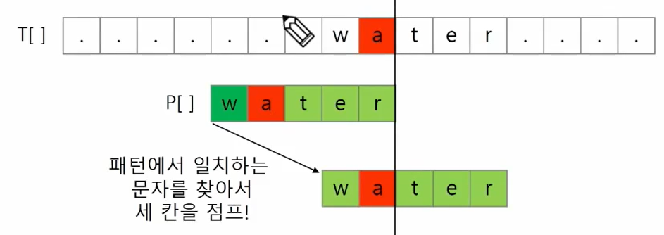
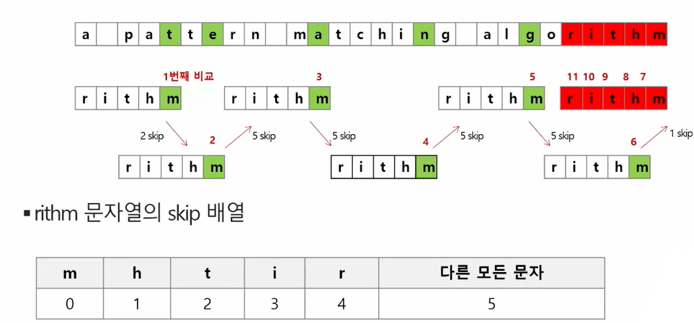

# 2022-02-16

# 문자열

- 아스키코드 (0~127 / 확장해서 255까지)

  - A : 65 / a : 97 -> 이 정도는 외워놓기

- 메모리가 저장되는 단위는 byte (1 byte = 8-bit)

- **strlen() 함수 만들어보기**

  - '\0' 을 만나면 '\0'을 제외한 글자수를 리턴하는 함수

  - ```python
    def mystrlen(s):
        i = 0
        while s[i] != '\0':
            i += 1
        return i
    ```

- ```python
  a = 'abc'
  b = 'abc'
  c = a[:2] + 'c'
  
  print(a == b)
  print(a is b)
  print(a == c)
  print(a is c)
  
  >>> True
  True
  True
  False
  ```

- **문자열 비교함수 만들어보기**

  - 문자열이 같으면 0 리턴
  - str1이 str2보다 사전 순서상 앞서면 음수 혹은 -1 리턴
  - str1이 str2보다 사전 순서상 나중이면 양수 혹은 1 리턴

- atoi() / itoa()

  - ord() : 문자의 아스키코드 숫자 반환

# 패턴 매칭

## 고지식한 패턴 검색 알고리즘 (Brute Force)

- 본문 문자열을 처음부터 끝까지 차례대로 순회하면서 패턴 내의 문자들을 일일이 비교하는 방식으로 동작
- 시간 복잡도 : O(MN) (M : 패턴 길이, N : 텍스트 길이)


## KMP 알고리즘

- 불일치가 발생한 텍스트 스트링의 앞 부분에 어떤 문자가 있는지를 미리 알고 있으므로, 불일치가 발생한 앞 부분에 대하여 다시 비교하지 않고 매칭을 수행
- 패턴을 전처리하여 배열 next[M]을 구하여 잘못된 시작 최소화
- 시간 복잡도 : O(M+N)
- 

- 매칭이 실패했을 때 돌아갈 곳을 계산한다.
  - 패턴의 각 위치에 대해 돌아갈 곳을 준비해둔다.
  - 위의 예시에서는 [-1, 0, 0, 0, 0, 1, 2, 3, 0, 0]
    - 여기에서 마지막 인덱스의 0은 패턴을 찾은 경우 다음 비교 위치를 표시하기 위함


## 보이어-무어 알고리즘

- 오른쪽에서 왼쪽으로 비교
- 패턴의 오른쪽 끝에 있는 문자가 불일치하고, 이 문자가 패턴 내에 존재하지 않는 경우, 한꺼번에 패턴의 길이만큼 점프해서 비교
  - 

- 패턴의 오른쪽 끝에 있는 문자가 불일치하고, 이 문자가 패턴 내에 존재할 경우
  - 

- 설명해보기
  - 

- 최악의 경우 수행시간 : O(MN)

